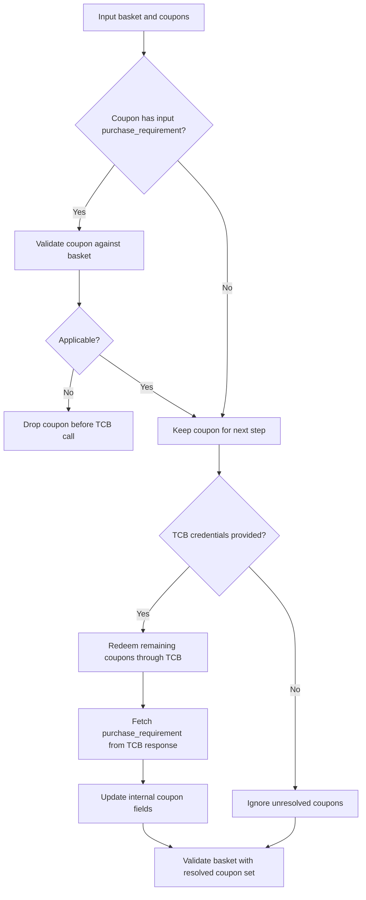

# Using `basket-validator-1.0-SNAPSHOT.jar`

Use this package as a library from your Java code.

## 1. Build the JAR

From the `java/` folder:

```bash
./build-jar.sh
```

That creates the regular JAR and the fat JAR:

```bash
target/basket-validator-1.0-SNAPSHOT.jar
target/basket-validator-1.0-SNAPSHOT-all.jar
```

## 2. Add the JAR to another Java project

If your project is not using Maven publishing, copy the fat JAR into your project, for example:

```bash
your-project/lib/basket-validator-1.0-SNAPSHOT-all.jar
```

## 3. Use it from Java code

Main classes:

- `org.thecouponbureau.validate.basket.Services.TcbTokenService`
- `org.thecouponbureau.validate.basket.Services.TcbScannedGs1Service`
- `org.thecouponbureau.validate.basket.core.BasketValidator`
- `org.thecouponbureau.validate.basket.model.basketValidationResults.BasketValidationInput`
- `org.thecouponbureau.validate.basket.model.basketValidationResults.ValidationResult`
- `org.thecouponbureau.validate.basket.Services.TcbCouponRedeemService`
- `org.thecouponbureau.validate.basket.Services.TcbCouponRollbackService`

Example:

```java
import org.thecouponbureau.validate.basket.core.BasketValidator;
import org.thecouponbureau.validate.basket.model.basketValidationResults;
import org.thecouponbureau.validate.basket.model.basketValidationResults.BasketValidationInput;
import org.thecouponbureau.validate.basket.model.basketValidationResults.BasketItem;
import org.thecouponbureau.validate.basket.model.basketValidationResults.InputCoupon;
import org.thecouponbureau.validate.basket.model.basketValidationResults.PurchaseRequirement;
import org.thecouponbureau.validate.basket.model.basketValidationResults.ValidationResult;

public class Main {
    public static void main(String[] args) {
        BasketItem item1 = new BasketItem();
        item1.productCode = "037000930396";
        item1.price = 1.29;
        item1.quantity = 1;
        item1.unit = "item";

        BasketItem item2 = new BasketItem();
        item2.productCode = "037000934677";
        item2.price = 1.34;
        item2.quantity = 1;
        item2.unit = "item";

        InputCoupon coupon1 = new InputCoupon();
        coupon1.gs1 = "8112009988459000019133924009755364";
        coupon1.purchaseRequirement = new PurchaseRequirement();
        coupon1.purchaseRequirement.primaryPurchaseGtins =
                java.util.Arrays.asList("037000930396", "037000934677");
        coupon1.purchaseRequirement.primaryPurchaseSaveValue = 100L;
        coupon1.purchaseRequirement.primaryPurchaseRequirements = 2L;
        coupon1.purchaseRequirement.primaryPurchaseReqCode = 0;
        coupon1.purchaseRequirement.saveValueCode = 0;

        InputCoupon coupon2 = new InputCoupon();
        coupon2.gs1 = "8112009988459000019133222024880382";

        BasketValidationInput input = new BasketValidationInput();
        input.basket = java.util.Arrays.asList(item1, item2);
        input.coupons = java.util.Arrays.asList(coupon1, coupon2);
        input.tcbBaseUrl = "https://api.try.thecouponbureau.org/";
        input.tcbAccessKey = "YOUR_ACCESS_KEY";
        input.tcbAccessToken = org.thecouponbureau.validate.basket.Services.TcbTokenService.fetchAccessToken(
                input.tcbBaseUrl,
                input.tcbAccessKey,
                "YOUR_SECRET_KEY");

        ValidationResult result = BasketValidator.validateBasketHelper(input);

        System.out.println(result.basketValidationOutput.discountInCents);
    }
}
```

## 4. JSON-string driven usage inside your own code

If your application already works with JSON strings, deserialize into `BasketValidationInput`.

The project uses Jackson `SNAKE_CASE`, so JSON like this maps correctly.

This example shows the supported caller input shape:

- each coupon object must contain `gs1`
- each coupon object may also include optional `purchase_requirement`
- `base_gs1` is internal and should not be supplied by the caller

```json
{
  "basket": [
    {
      "product_code": "037000758365",
      "price": 1.99,
      "quantity": 12,
      "unit": "item"
    },
    {
      "product_code": "7106919588011",
      "price": 1.81,
      "quantity": 2,
      "unit": "item"
    },
    {
      "product_code": "037000925033",
      "price": 1.59,
      "quantity": 3,
      "unit": "item"
    }
  ],
  "coupons": [
    {
      "gs1": "8112109988459000269133321426026193",
      "purchase_requirement": {
        "primary_purchase_gtins": [
          "037000930396",
          "037000934677"
        ],
        "primary_purchase_save_value": 100,
        "primary_purchase_requirements": 2,
        "primary_purchase_req_code": 0,
        "save_value_code": 0
      }
    },
    {
      "gs1": "8112109988459000269133587761214614"
    }
  ]
}
```

Example:

```java
import com.fasterxml.jackson.databind.ObjectMapper;
import com.fasterxml.jackson.databind.PropertyNamingStrategies;

import org.thecouponbureau.validate.basket.core.BasketValidator;
import org.thecouponbureau.validate.basket.model.basketValidationResults.BasketValidationInput;
import org.thecouponbureau.validate.basket.model.basketValidationResults.ValidationResult;

public class Main {
    public static void main(String[] args) throws Exception {
        ObjectMapper mapper = new ObjectMapper();
        mapper.setPropertyNamingStrategy(PropertyNamingStrategies.SNAKE_CASE);

        String jsonInput = """
                {
                  "basket": [
                    {
                      "product_code": "037000758365",
                      "price": 1.99,
                      "quantity": 12,
                      "unit": "item"
                    },
                    {
                      "product_code": "7106919588011",
                      "price": 1.81,
                      "quantity": 2,
                      "unit": "item"
                    },
                    {
                      "product_code": "037000925033",
                      "price": 1.59,
                      "quantity": 3,
                      "unit": "item"
                    }
                  ],
                  "coupons": [
                    {
                      "gs1": "8112109988459000269133321426026193",
                      "purchase_requirement": {
                        "primary_purchase_gtins": [
                          "037000930396",
                          "037000934677"
                        ],
                        "primary_purchase_save_value": 100,
                        "primary_purchase_requirements": 2,
                        "primary_purchase_req_code": 0,
                        "save_value_code": 0
                      }
                    },
                    {
                      "gs1": "8112109988459000269133587761214614"
                    }
                  ]
                }
                """;

        BasketValidationInput input =
                mapper.readValue(jsonInput, BasketValidationInput.class);

        ValidationResult result = BasketValidator.validateBasketHelper(input);
        System.out.println(mapper.writerWithDefaultPrettyPrinter().writeValueAsString(result));
    }
}
```

## 5. Fetch TCB access token

Fetch the token first, then reuse that token for resolve, validate, redeem, and rollback.

Use:

- `org.thecouponbureau.validate.basket.Services.TcbTokenService.fetchAccessToken(...)`
- `org.thecouponbureau.validate.basket.Services.TcbTokenService.fetchAccessTokenResponse(...)`

Example:

```java
String accessToken = org.thecouponbureau.validate.basket.Services.TcbTokenService.fetchAccessToken(
        "https://api.try.thecouponbureau.org",
        "YOUR_ACCESS_KEY",
        "YOUR_SECRET_KEY");
```

If you want to print the full token response, read `x-access-token`, and save it for reuse in your own application cache, use:

```java
import java.nio.file.Files;
import java.nio.file.Path;
import java.time.Instant;

import com.fasterxml.jackson.databind.ObjectMapper;
import com.fasterxml.jackson.databind.node.ObjectNode;
import org.thecouponbureau.validate.basket.Services.TcbTokenService;

public class TokenExample {
    public static void main(String[] args) throws Exception {
        ObjectMapper mapper = new ObjectMapper();

        TcbTokenService.AccessTokenResponse tokenResponse =
                TcbTokenService.fetchAccessTokenResponse(
                        "https://api.try.thecouponbureau.org",
                        "YOUR_ACCESS_KEY",
                        "YOUR_SECRET_KEY");

        System.out.println(mapper.writerWithDefaultPrettyPrinter().writeValueAsString(tokenResponse));

        String accessToken = tokenResponse.accessToken;

        ObjectNode cacheJson = mapper.createObjectNode();
        cacheJson.put("status", tokenResponse.status);
        cacheJson.put("x-access-token", accessToken);
        cacheJson.put("created_at_epoch_ms", Instant.now().toEpochMilli());

        Files.writeString(
                Path.of("tcb-access-token-cache.json"),
                mapper.writerWithDefaultPrettyPrinter().writeValueAsString(cacheJson));
    }
}
```

That cache file is application-owned. The SDK does not reuse it automatically. TCB states the token is valid for 24 hours, so your application can reload this file and reuse `x-access-token` until your own expiry policy says to refresh it.

## 6. Resolve scanned GS1s into serialized GS1 + base GS1

Use:

- `org.thecouponbureau.validate.basket.Services.TcbScannedGs1Service.parseScannedGs1s(...)`

This method:

- accepts a list of scanned GS1 strings
- parses consumer serialized data strings locally when possible
- returns `gs1` and `base_gs1`
- if the scanned code is `16` digits, or not a consumer serialized data string, calls TCB `retailer/redeem`
- uses `newly_redeemed` from the TCB response
- returns only the serialized `gs1` and associated `base_gs1`
- does not return `purchase_requirement`

Example:

```java
import java.util.List;

import org.thecouponbureau.validate.basket.Services.TcbScannedGs1Service;
import org.thecouponbureau.validate.basket.Services.TcbTokenService;

public class ParseScannedGs1Example {
    public static void main(String[] args) {
        String accessToken = TcbTokenService.fetchAccessToken(
                "https://api.try.thecouponbureau.org/",
                "YOUR_ACCESS_KEY",
                "YOUR_SECRET_KEY");

        List<TcbScannedGs1Service.SerializedGs1Data> resolved =
                TcbScannedGs1Service.parseScannedGs1s(
                        "https://api.try.thecouponbureau.org/",
                        "YOUR_ACCESS_KEY",
                        accessToken,
                        List.of(
                                "8112209988459000329165266614604064",
                                "8112209988459000340001"
                        )
                );

        for (TcbScannedGs1Service.SerializedGs1Data item : resolved) {
            System.out.println(item.gs1 + " -> " + item.baseGs1);
        }
    }
}
```

Example resolve JSON response:

```json
[
  {
    "gs1": "8112209988459000329165266614604064",
    "base_gs1": "811220998845900032"
  },
  {
    "gs1": "8112109988459000269133321426026193",
    "base_gs1": "811210998845900026"
  },
  {
    "gs1": "8112109988459000269133587761214614",
    "base_gs1": "811210998845900026"
  }
]
```

## 7. Validate basket

The caller must send `gs1` for every coupon. The caller may also send optional `purchase_requirement` for some coupons. The validator uses this flow:

- first, coupons that already include `purchase_requirement` are checked against the basket
- coupons that are not applicable are removed before any TCB call
- then the remaining coupons are redeemed through TCB
- the SDK updates the internal coupon fields from the TCB response
- then final basket validation runs on the resolved coupon set



Set these fields on `BasketValidationInput` before calling:

```java
input.tcbBaseUrl = "https://api.try.thecouponbureau.org";
input.tcbAccessKey = "YOUR_ACCESS_KEY";
input.tcbAccessToken = accessToken;
```

If these are not provided, unresolved coupons are ignored because the SDK cannot fetch `purchase_requirement`.

Example:

```java
input.tcbBaseUrl = "https://api.try.thecouponbureau.org/";
input.tcbAccessKey = "8053fd0f80cf3778659def1359cac218";
input.tcbAccessToken = accessToken;
```

Optional debug logging:

```java
input.enableLogging = true;
```

When `enableLogging` is `true`, the validator prints pretty JSON logs for:

- the input payload before validation starts
- each TCB resolution redeem request payload used to fetch missing `purchase_requirement`
- each TCB resolution redeem response body returned by the API
- the resolved coupon JSON after internal coupon fields are populated

The resolved output log also prints `coupon_gs1_order` so you can verify that coupon order is still maintained based on the input `gs1` values.

The input log redacts `tcbAccessKey` and `tcbAccessToken`.

Example validation JSON response:

```json
{
  "basket_validation_output": {
    "discount_in_cents": 100,
    "applied_coupons": [
      {
        "coupon_code": "8112109988459000269133321426026193",
        "face_value_in_cents": 100,
        "product_codes": {
          "primary": [
            "037000930396",
            "037000934677"
          ]
        }
      }
    ]
  },
  "not_all_coupons_consumed": true,
  "error": null
}
```

## 8. Redeem coupons in TCB after discount application

After your retailer system applies the discount, it should redeem the applied coupons in TCB.

Use:

- `org.thecouponbureau.validate.basket.Services.TcbCouponRedeemService.redeemCoupons(...)`

This method:

- accepts an array/list of GS1 coupon codes
- uses the provided TCB access token
- calls the same `retailer/redeem` API
- if more than `15` GS1s are provided, splits them into chunks of `15`
- sends those redeem calls in parallel for faster network performance
- merges the chunk responses into one JSON response
- returns the raw JSON response body from TCB
- does not send the `pre_process` field
- generates one `client_txn_id` per chunked redemption request
- reuses that same `client_txn_id` across retries for idempotency

Example:

```java
import java.util.List;

import org.thecouponbureau.validate.basket.Services.TcbCouponRedeemService;
import org.thecouponbureau.validate.basket.Services.TcbTokenService;

public class RedeemExample {
    public static void main(String[] args) {
        String accessToken = TcbTokenService.fetchAccessToken(
                "https://api.try.thecouponbureau.org/",
                "8053fd0f80cf3778659def1359cac218",
                "eb42623aa2675e50f15da4f6d4aa0ad6");

        String responseJson = TcbCouponRedeemService.redeemCoupons(
                "https://api.try.thecouponbureau.org/",
                "8053fd0f80cf3778659def1359cac218",
                accessToken,
                List.of(
                        "8112109988459000269133321426026193",
                        "8112109988459000269133587761214614"
                )
        );

        System.out.println(responseJson);
    }
}
```

Note: `enableLogging` only affects validation-time GS1 resolution inside `BasketValidator.validateBasketHelper(...)`. It does not change the output of `TcbCouponRedeemService.redeemCoupons(...)`.

Example redeem JSON response:

```json
{
  "status": "success",
  "status_code": "FULL_REDEMPTION",
  "newly_redeemed": [
    {
      "gs1": "8112109988459000269133321426026193",
      "master_offer_file": "811210998845900026",
      "stakeholders_email_domain": []
    },
    {
      "gs1": "8112109988459000269133587761214614",
      "master_offer_file": "811210998845900026",
      "stakeholders_email_domain": []
    }
  ],
  "total_gs1s_processed": 2,
  "message": "Redeemed 2 gs1(s)",
  "execution_id": "44ac8356-9e97-46a7-afd2-5d826b0a872e"
}
```

## 9. Dependency note

For application integration, use:

```bash
target/basket-validator-1.0-SNAPSHOT-all.jar
```

That fat JAR already includes dependencies for embedding in your Java project.

## 10. Rollback redeemed coupons in TCB

If your retailer needs to reverse previously redeemed coupons, use:

- `org.thecouponbureau.validate.basket.Services.TcbCouponRollbackService.rollbackCoupons(...)`

This method:

- accepts a list of GS1 coupon codes
- uses the provided TCB access token
- calls `DELETE /retailer/rollback/{gs1}`
- calls each rollback in parallel, one API request per GS1
- returns a `Map<String, String>` where:
  - key = GS1
  - value = raw JSON response from TCB

Example:

```java
import java.util.List;
import java.util.Map;

import org.thecouponbureau.validate.basket.Services.TcbCouponRollbackService;
import org.thecouponbureau.validate.basket.Services.TcbTokenService;

public class RollbackExample {
    public static void main(String[] args) {
        String accessToken = TcbTokenService.fetchAccessToken(
                "https://api.try.thecouponbureau.org/",
                "8053fd0f80cf3778659def1359cac218",
                "eb42623aa2675e50f15da4f6d4aa0ad6");

        Map<String, String> rollbackResponses = TcbCouponRollbackService.rollbackCoupons(
                "https://api.try.thecouponbureau.org/",
                "8053fd0f80cf3778659def1359cac218",
                accessToken,
                List.of(
                        "8112109988459000269133321426026193",
                        "8112109988459000269133587761214614"
                )
        );

        for (Map.Entry<String, String> entry : rollbackResponses.entrySet()) {
            System.out.println(entry.getKey() + " -> " + entry.getValue());
        }
    }
}
```

Example rollback JSON response map:

```json
{
  "8112109988459000269133321426026193": "{\"status\":\"success\",\"message\":\"Coupon rollback successful\"}",
  "8112109988459000269133587761214614": "{\"status\":\"success\",\"message\":\"Coupon rollback successful\"}"
}
```
