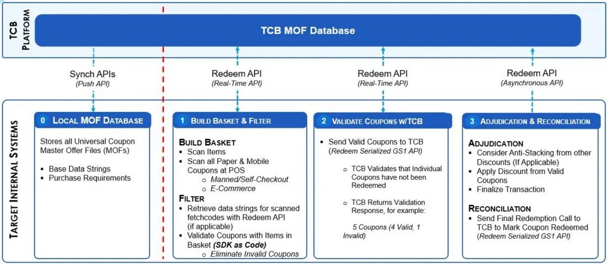
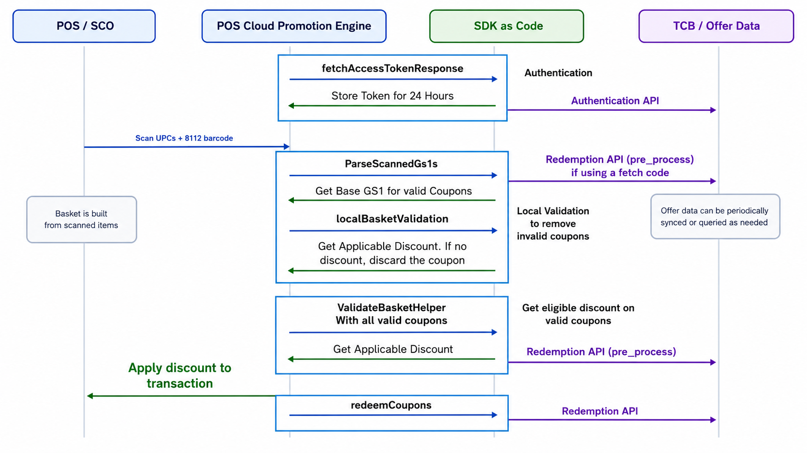

# Java integration flow

## High Level Architecture



<br/>
<br/>

## Sequence Diagram



## 1. Build the JAR

From the `java/` folder:

```bash
./build-jar.sh
```

Use the JAR for integration:

```bash
target/basket-validator-1.0-SNAPSHOT.jar
```

## 2. Add the JAR to your project

Copy the fat JAR into your application, for example:

```bash
your-project/lib/basket-validator-1.0-SNAPSHOT.jar
```

After that, add the JAR from your `lib/` folder to your Java project classpath using your normal build setup.

## 3. Sync MOF purchase requirements into your server

Use `TcbMofSyncService.syncMasterOfferFiles(...)` to pull Master Offer File purchase requirements into your database so basket validation can use local purchase requirements instead of waiting on live MOF lookups.

Request:

```java
import org.thecouponbureau.validate.basket.Services.TcbMofSyncService;

TcbMofSyncService.SyncMofResponse mofResponse =
        TcbMofSyncService.syncMasterOfferFiles(
                "https://api.portal.thecouponbureau.org",
                "YOUR_ACCESS_KEY",
                accessToken,
                "initial",
                "");

System.out.println("nextPageNo = " + mofResponse.nextPageNo);

for (TcbMofSyncService.MasterOfferFileRecord record : mofResponse.data) {
    System.out.println("base_gs1 = " + record.baseGs1);
    System.out.println(
            "primaryPurchaseGtins = "
                    + record.purchaseRequirement.primaryPurchaseGtins);
}
```

Example Redis storage pattern:

> **Optional: Install Redis locally before using the Redis examples**
>
> **macOS**
> 1. `brew install redis`
> 2. `brew services start redis`
> 3. Verify with `redis-cli ping`
>
> **Linux (Ubuntu/Debian)**
> 1. `sudo apt update`
> 2. `sudo apt install redis-server`
> 3. `sudo systemctl enable redis-server`
> 4. `sudo systemctl start redis-server`
> 5. Verify with `redis-cli ping`
>
> **Windows**
> 1. Install Docker Desktop
> 2. Run `docker run --name redis -p 6379:6379 -d redis`
> 3. Verify with `docker exec -it redis redis-cli ping`
>
> If Redis is not needed in your environment, skip this and use any other local database keyed by `base_gs1`.

```java
import com.fasterxml.jackson.databind.ObjectMapper;
import redis.clients.jedis.Jedis;

ObjectMapper mapper = new ObjectMapper();

try (Jedis jedis = new Jedis("localhost", 6379)) {
    for (TcbMofSyncService.MasterOfferFileRecord record : mofResponse.data) {
        String purchaseRequirementJson =
                mapper.writeValueAsString(record.purchaseRequirement);

        jedis.set(record.baseGs1, purchaseRequirementJson);
    }
}
```

Mode behavior:

- `initial` = last 6 months through today
- `incremental` = yesterday through today

Example date windows if today is `2026-08-17`:

- `initial` => `2026-02-17` through `2026-08-17`
- `incremental` => `2026-08-16` through `2026-08-17`

Returned shape:

- `data[].baseGs1`
- `data[].purchaseRequirement.primaryPurchaseGtins`
- `data[].purchaseRequirement.primaryPurchaseRequirements`
- `data[].purchaseRequirement.primaryPurchaseReqCode`
- `data[].purchaseRequirement.saveValueCode`
- and the other SDK-native `PurchaseRequirement` fields

Use `nextPageNo` to request the next page. When `nextPageNo = -1`, there are no more records.

Retry behavior for this helper:

- retries only on `5XX`
- first retry after `10` seconds
- second retry after `20` seconds

## 4. Step-by-step integration

This walkthrough uses real serialized coupon examples and `base_gs1` values from `java/POS_Basket_Validation_UseCases.xlsx`.

The `16`-digit fetch code below is illustrative. The workbook contains serialized coupon examples and offer data, but not the fetch-code-to-coupon mapping returned by TCB.

#### Step 1. Customer scans four serialized coupons and one fetch code

| Scan order | Type | Scanned value |
| --- | --- | --- |
| 1 | Serialized coupon | `8112009988459000019133924009755364` |
| 2 | Serialized coupon | `8112009988459000039133772240739897` |
| 3 | Serialized coupon | `8112009988459000049133939957096441` |
| 4 | Serialized coupon | `8112009988459000199133935966961409` |
| 5 | 16-digit fetch code | `8112209988459000` |

#### Step 2. Get the TCB token

Request:

```java
String accessToken = org.thecouponbureau.validate.basket.Services.TcbTokenService.fetchAccessToken(
        "https://api.try.thecouponbureau.org",
        "YOUR_ACCESS_KEY",
        "YOUR_SECRET_KEY");
```

Response:

```json
{
  "status": "success",
  "x-access-token": "YOUR_ACCESS_TOKEN"
}
```

#### Step 3. Resolve scanned values into serialized coupons and `base_gs1`

Request:

```java
import com.fasterxml.jackson.databind.ObjectMapper;
import com.fasterxml.jackson.databind.PropertyNamingStrategies;

import org.thecouponbureau.validate.basket.Services.TcbScannedGs1Service;

List<TcbScannedGs1Service.SerializedGs1Data> resolved =
        TcbScannedGs1Service.parseScannedGs1s(
                "https://api.try.thecouponbureau.org/",
                "YOUR_ACCESS_KEY",
                accessToken,
                List.of(
                        "8112009988459000019133924009755364",
                        "8112009988459000039133772240739897",
                        "8112009988459000049133939957096441",
                        "8112009988459000199133935966961409",
                        "8112209988459000"));

ObjectMapper mapper = new ObjectMapper();
mapper.setPropertyNamingStrategy(PropertyNamingStrategies.SNAKE_CASE);

System.out.println("Resolved scanned GS1 response:");
System.out.println(
        mapper.writerWithDefaultPrettyPrinter().writeValueAsString(resolved));

for (TcbScannedGs1Service.SerializedGs1Data item : resolved) {
    System.out.println(
            "serialized_gs1=" + item.gs1
                    + ", base_gs1=" + item.baseGs1
                    + ", validated=" + item.validated);
}
```

- The first four scanned values already start with `8112`, so `parseScannedGs1s(...)` parses them locally.
- The `16`-digit fetch code is sent to TCB in its own redemption request.
- Assume TCB returns the following additional serialized coupons from that fetch code.

Response:

```json
[
  {
    "gs1": "8112009988459000019133924009755364",
    "base_gs1": "811200998845900001"
  },
  {
    "gs1": "8112009988459000039133772240739897",
    "base_gs1": "811200998845900003"
  },
  {
    "gs1": "8112009988459000049133939957096441",
    "base_gs1": "811200998845900004"
  },
  {
    "gs1": "8112009988459000199133935966961409",
    "base_gs1": "811200998845900019"
  },
  {
    "gs1": "8112009988459000019133520317194861",
    "base_gs1": "811200998845900001",
    "validated": true
  }
]
```

| Source | Serialized coupon | `base_gs1` |
| --- | --- | --- |
| Local parse | `8112009988459000019133924009755364` | `811200998845900001` |
| Local parse | `8112009988459000039133772240739897` | `811200998845900003` |
| Local parse | `8112009988459000049133939957096441` | `811200998845900004` |
| Local parse | `8112009988459000199133935966961409` | `811200998845900019` |
| TCB fetch-code response | `8112009988459000019133520317194861` | `811200998845900001` |
| TCB fetch-code response | `8112009988459000039133690612006084` | `811200998845900003` |
| TCB fetch-code response | `8112009988459000049133457646689353` | `811200998845900004` |
| TCB fetch-code response | `8112009988459000059133286213033835` | `811200998845900005` |
| TCB fetch-code response | `8112009988459000089133401940529627` | `811200998845900008` |
| TCB fetch-code response | `8112009988459000119133614973675487` | `811200998845900011` |
| TCB fetch-code response | `8112009988459000129133212234898075` | `811200998845900012` |
| TCB fetch-code response | `8112009988459000139133621151540206` | `811200998845900013` |
| TCB fetch-code response | `8112009988459000149133342361220548` | `811200998845900014` |
| TCB fetch-code response | `8112009988459000199133782272284945` | `811200998845900019` |

For TCB fetch-code results, `validated = true` means the coupon was already validated by TCB during fetch-code expansion.

#### Step 4. Load purchase requirements from the local `base_gs1` database

Use `base_gs1` as the key into your local offer / purchase-requirement database.

If you store purchase requirements in Redis, use:

- key = `base_gs1`
- value = serialized `purchase_requirement` JSON

Example Redis lookup:

```java
import com.fasterxml.jackson.databind.ObjectMapper;
import redis.clients.jedis.Jedis;

import org.thecouponbureau.validate.basket.model.basketValidationResults.PurchaseRequirement;

ObjectMapper mapper = new ObjectMapper();

try (Jedis jedis = new Jedis("localhost", 6379)) {
    for (TcbScannedGs1Service.SerializedGs1Data item : resolved) {
        String purchaseRequirementJson = jedis.get(item.baseGs1);

        if (purchaseRequirementJson == null) {
            continue;
        }

        PurchaseRequirement purchaseRequirement =
                mapper.readValue(
                        purchaseRequirementJson,
                        PurchaseRequirement.class);

        System.out.println(
                "gs1=" + item.gs1
                        + ", base_gs1=" + item.baseGs1
                        + ", validated=" + item.validated
                        + ", primaryPurchaseGtins="
                        + purchaseRequirement.primaryPurchaseGtins);
    }
}
```

Response from local DB lookup:

| `base_gs1` | Workbook offer summary |
| --- | --- |
| `811200998845900001` | Buy 2 Products in Group A and Save $1.00 |
| `811200998845900003` | Buy any 2 products from A or B and save $1.00 |
| `811200998845900004` | Buy any 2 products from A or B or C and save $1.00 |
| `811200998845900005` | Buy 1 get 1 free up to $1.99 |
| `811200998845900008` | Buy 5 Products in Group A and get 2 Free from Group B |
| `811200998845900011` | Buy 1 item from Group A get 1 item from Group B free up to $1.99 |
| `811200998845900012` | Spend $5 on chips OR dip OR soda and get $2 off |
| `811200998845900013` | Spend $5 on chips AND dip AND soda and get $3 off |
| `811200998845900014` | Spend $5 on chips AND dip OR soda and get $2 off |
| `811200998845900019` | Buy 1A and 2B and 3C and get $3 off |

#### Step 5. Build coupon objects from resolved GS1 values and local purchase requirements

Request:

```java
import com.fasterxml.jackson.databind.ObjectMapper;
import java.util.ArrayList;
import java.util.List;

import redis.clients.jedis.Jedis;

import org.thecouponbureau.validate.basket.Services.TcbScannedGs1Service;
import org.thecouponbureau.validate.basket.model.basketValidationResults.InputCoupon;
import org.thecouponbureau.validate.basket.model.basketValidationResults.PurchaseRequirement;

List<String> scannedCoupons = List.of(
        "8112009988459000019133924009755364",
        "8112009988459000039133772240739897",
        "8112009988459000049133939957096441",
        "8112009988459000199133935966961409",
        "8112209988459000");

List<TcbScannedGs1Service.SerializedGs1Data> resolved =
        TcbScannedGs1Service.parseScannedGs1s(
                "https://api.try.thecouponbureau.org/",
                "YOUR_ACCESS_KEY",
                accessToken,
                scannedCoupons);

ObjectMapper mapper = new ObjectMapper();

List<InputCoupon> coupons = new ArrayList<>();
try (Jedis jedis = new Jedis("localhost", 6379)) {
    for (TcbScannedGs1Service.SerializedGs1Data item : resolved) {
        String purchaseRequirementJson = jedis.get(item.baseGs1);

        if (purchaseRequirementJson == null) {
            continue;
        }

        PurchaseRequirement purchaseRequirement =
                mapper.readValue(
                        purchaseRequirementJson,
                        PurchaseRequirement.class);

        InputCoupon coupon = new InputCoupon();
        coupon.gs1 = item.gs1;
        coupon.purchaseRequirement = purchaseRequirement;
        coupon.validated = item.validated;
        coupons.add(coupon);
    }
}
```

This sample resolves each scanned value to `gs1` + `base_gs1` using the SDK first, then reads the purchase requirement from Redis using `base_gs1` as the key.

If you want the Redis loading logic as a reusable helper, use:

```java
import com.fasterxml.jackson.databind.ObjectMapper;
import java.util.HashMap;
import java.util.Map;
import redis.clients.jedis.Jedis;

import org.thecouponbureau.validate.basket.model.basketValidationResults.PurchaseRequirement;

Map<String, PurchaseRequirement> loadPurchaseRequirementDb() throws Exception {
    ObjectMapper mapper = new ObjectMapper();
    Map<String, PurchaseRequirement> purchaseRequirements = new HashMap<>();

    try (Jedis jedis = new Jedis("localhost", 6379)) {
        for (String baseGs1 : jedis.keys("*")) {
            String purchaseRequirementJson = jedis.get(baseGs1);

            if (purchaseRequirementJson == null) {
                continue;
            }

            purchaseRequirements.put(
                    baseGs1,
                    mapper.readValue(
                            purchaseRequirementJson,
                            PurchaseRequirement.class));
        }
    }

    return purchaseRequirements;
}
```

Response:

```json
{
  "coupons": [
    {
      "gs1": "8112009988459000019133924009755364",
      "purchase_requirement": { "...": "loaded from local DB using 811200998845900001" }
    },
    {
      "gs1": "8112009988459000039133772240739897",
      "purchase_requirement": { "...": "loaded from local DB using 811200998845900003" }
    },
    {
      "gs1": "8112009988459000049133939957096441",
      "purchase_requirement": { "...": "loaded from local DB using 811200998845900004" }
    },
    {
      "gs1": "8112009988459000199133935966961409",
      "purchase_requirement": { "...": "loaded from local DB using 811200998845900019" }
    },
    {
      "gs1": "8112009988459000139133621151540206",
      "purchase_requirement": { "...": "loaded from local DB using 811200998845900013" }
    },
    {
      "gs1": "8112009988459000089133401940529627",
      "purchase_requirement": { "...": "loaded from local DB using 811200998845900008" }
    }
  ]
}
```

#### Step 6. Build the basket and perform local rejection first

Request basket:

Basket example:

| Product code | Qty | Price |
| --- | --- | --- |
| `037000930396` | 1 | `1.29` |
| `037000934677` | 1 | `1.34` |
| `030772076835` | 2 | `3.07` |
| `037000534358` | 1 | `6.62` |
| `037000808893` | 1 | `5.64` |
| `7106919588011` | 1 | `1.81` |
| `8952803493171` | 1 | `4.67` |

Call `localBasketValidation(...)` one coupon at a time in this step.

Important:

This method does not take TCB credentials. It only uses the basket and the locally loaded `purchase_requirement`.

Request:

```java
import java.util.ArrayList;
import java.util.List;

import org.thecouponbureau.validate.basket.core.BasketValidator;
import org.thecouponbureau.validate.basket.model.basketValidationResults.InputCoupon;
import org.thecouponbureau.validate.basket.model.basketValidationResults.LocalBasketValidationInput;
import org.thecouponbureau.validate.basket.model.basketValidationResults.ValidationResult;

List<InputCoupon> locallyEligibleCoupons = new ArrayList<>();

for (InputCoupon coupon : coupons) {
    LocalBasketValidationInput localInput = new LocalBasketValidationInput();
    localInput.basket = basket;
    localInput.coupons = List.of(coupon);

    ValidationResult localResult = BasketValidator.localBasketValidation(localInput);

    if (localResult.error != null) {
        continue;
    }

    if (localResult.basketValidationOutput != null
            && localResult.basketValidationOutput.discountInCents > 0) {
        locallyEligibleCoupons.add(coupon);
    }
}
```

Response:

```json
{
  "eligible_coupon_gs1s": [
    "8112009988459000019133924009755364",
    "8112009988459000039133772240739897",
    "8112009988459000049133939957096441"
  ],
  "rejected_coupon_gs1s": [
    "8112009988459000199133935966961409",
    "8112009988459000139133621151540206",
    "8112009988459000089133401940529627"
  ]
}
```

Coupons kept after local filtering for the second pass:

- `8112009988459000019133924009755364`
- `8112009988459000039133772240739897`
- `8112009988459000049133939957096441`

#### Step 7. Build the validation input

In this second pass, send coupon objects in `coupons` with:

- `gs1`
- `purchase_requirement`
- optional `validated = true`

Optimization:

- if `validated = true`, `validateBasketHelper(...)` skips the TCB validation call for that coupon
- if `validated` is not `true`, `validateBasketHelper(...)` calls TCB `retailer/redeem` with:
  - `pre_process = "yes"`
  - `no_purchase_requirement = "yes"`
- coupons not returned in `newly_redeemed` are removed
- the remaining coupons already have local `purchase_requirement` objects, so the final discount is calculated locally

Request:

```java
import java.util.ArrayList;
import java.util.List;

import org.thecouponbureau.validate.basket.model.basketValidationResults.BasketItem;
import org.thecouponbureau.validate.basket.model.basketValidationResults.BasketValidationInput;
List<BasketItem> basket = new ArrayList<>();

BasketItem item1 = new BasketItem();
item1.productCode = "037000930396";
item1.price = 1.29;
item1.quantity = 1;
item1.unit = "item";
basket.add(item1);

BasketItem item2 = new BasketItem();
item2.productCode = "037000934677";
item2.price = 1.34;
item2.quantity = 1;
item2.unit = "item";
basket.add(item2);

BasketItem item3 = new BasketItem();
item3.productCode = "030772076835";
item3.price = 3.07;
item3.quantity = 2;
item3.unit = "item";
basket.add(item3);

BasketItem item4 = new BasketItem();
item4.productCode = "037000534358";
item4.price = 6.62;
item4.quantity = 1;
item4.unit = "item";
basket.add(item4);

BasketItem item5 = new BasketItem();
item5.productCode = "037000808893";
item5.price = 5.64;
item5.quantity = 1;
item5.unit = "item";
basket.add(item5);

List<InputCoupon> coupons = new ArrayList<>();
for (InputCoupon localCoupon : locallyEligibleCoupons) {
    InputCoupon coupon = new InputCoupon();
    coupon.gs1 = localCoupon.gs1;
    coupon.purchaseRequirement = localCoupon.purchaseRequirement;
    coupon.validated = localCoupon.validated;
    coupons.add(coupon);
}

BasketValidationInput input = new BasketValidationInput();
input.basket = basket;
input.coupons = coupons;
```

Resulting input payload shape:

```json
{
  "basket": [
    { "product_code": "037000930396", "price": 1.29, "quantity": 1, "unit": "item" },
    { "product_code": "037000934677", "price": 1.34, "quantity": 1, "unit": "item" },
    { "product_code": "030772076835", "price": 3.07, "quantity": 2, "unit": "item" },
    { "product_code": "037000534358", "price": 6.62, "quantity": 1, "unit": "item" },
    { "product_code": "037000808893", "price": 5.64, "quantity": 1, "unit": "item" }
  ],
  "coupons": [
    {
      "gs1": "8112009988459000019133924009755364",
      "purchase_requirement": { "...": "loaded from local DB using 811200998845900001" },
      "validated": true
    },
    {
      "gs1": "8112009988459000039133772240739897",
      "purchase_requirement": { "...": "loaded from local DB using 811200998845900003" }
    },
    {
      "gs1": "8112009988459000049133939957096441",
      "purchase_requirement": { "...": "loaded from local DB using 811200998845900004" }
    }
  ]
}
```

#### Step 8. Call `validateBasketHelper(...)`

Request:

```java
input.tcbBaseUrl = "https://api.try.thecouponbureau.org";
input.tcbAccessKey = "YOUR_ACCESS_KEY";
input.tcbAccessToken = accessToken;

ValidationResult result = BasketValidator.validateBasketHelper(input);
```

What happens inside this second validation pass:

1. Coupons with `validated = true` are kept as already validated.
2. Coupons without `validated = true` are sent to TCB `retailer/redeem`.
3. That TCB request uses `pre_process = "yes"` and `no_purchase_requirement = "yes"`.
4. Coupons not returned in `newly_redeemed` are removed.
5. Final basket validation runs locally using the surviving coupons and their local `purchase_requirement` objects.

Response:

```json
{
  "discount_in_cents": 300,
  "applied_coupons": [
    {
      "coupon_code": "8112009988459000019133924009755364",
      "face_value_in_cents": 100,
      "product_codes": {
        "gtins": [
          "037000930396",
          "037000934677"
        ]
      }
    },
    {
      "coupon_code": "8112009988459000039133772240739897",
      "face_value_in_cents": 100,
      "product_codes": {
        "gtins": [
          "030772076835"
        ]
      }
    },
    {
      "coupon_code": "8112009988459000049133939957096441",
      "face_value_in_cents": 100,
      "product_codes": {
        "gtins": [
          "037000534358",
          "037000808893"
        ]
      }
    }
  ]
}
```

#### Step 8. Apply the discount

Use `result.basketValidationOutput.discountInCents` as the transaction discount.

Response used by POS:

```json
{
  "discount_in_cents": 300
}
```

#### Step 9. Redeem coupons in TCB after discount application

Request:

```java
String redeemResponseJson =
        org.thecouponbureau.validate.basket.Services.TcbCouponRedeemService.redeemCoupons(
                "https://api.try.thecouponbureau.org",
                "YOUR_ACCESS_KEY",
                accessToken,
                Arrays.asList(
                        "8112009988459000019133924009755364",
                        "8112009988459000039133772240739897",
                        "8112009988459000049133939957096441"));
```

Response:

```json
{
  "status": "success",
  "status_code": "FULL_REDEMPTION",
  "newly_redeemed": [
    {
      "gs1": "8112009988459000019133924009755364",
      "master_offer_file": "811200998845900001"
    },
    {
      "gs1": "8112009988459000039133772240739897",
      "master_offer_file": "811200998845900003"
    },
    {
      "gs1": "8112009988459000049133939957096441",
      "master_offer_file": "811200998845900004"
    }
  ],
  "total_gs1s_processed": 3,
  "message": "Redeemed 3 gs1(s)"
}
```

#### Step 10. Roll back redeemed coupons if the transaction is voided

Request:

```java
Map<String, String> rollbackResponses =
        org.thecouponbureau.validate.basket.Services.TcbCouponRollbackService.rollbackCoupons(
                "https://api.try.thecouponbureau.org",
                "YOUR_ACCESS_KEY",
                accessToken,
                Arrays.asList(
                        "8112009988459000019133924009755364",
                        "8112009988459000039133772240739897",
                        "8112009988459000049133939957096441"));
```

Response:

```json
{
  "8112009988459000019133924009755364": "{\"status\":\"success\",\"message\":\"Coupon rollback successful\"}",
  "8112009988459000039133772240739897": "{\"status\":\"success\",\"message\":\"Coupon rollback successful\"}",
  "8112009988459000049133939957096441": "{\"status\":\"success\",\"message\":\"Coupon rollback successful\"}"
}
```

## End-to-End Flow Diagram

```text
1. POS scans coupons and builds basket
   |
   v
2. Parse scanned GS1 values
   - serialized GS1s parsed locally
   - fetch codes expanded through TCB if needed
   |
   v
3. Use base_gs1 to load purchase requirements from local DB
   |
   v
4. Call localBasketValidation(...) one coupon at a time
   - drop coupons that are not basket-eligible locally
   |
   v
5. Build final validateBasketHelper(...) input
   - gs1
   - purchase_requirement
   - validated=true only for coupons already validated earlier
   |
   v
6. Call validateBasketHelper(...)
   - skips TCB for validated=true coupons
   - calls TCB retailer/redeem for remaining coupons
     with pre_process=yes and no_purchase_requirement=yes
   - removes coupons not returned in newly_redeemed
   - calculates final discount locally
   |
   v
7. POS applies discount to transaction
   |
   v
8. After transaction success, call redeemCoupons(...)
   |
   v
9. If transaction is voided later, call rollbackCoupons(...)
```

## Complete Java Example

The following example hardcodes basket data and scanned coupon values, then uses the SDK to resolve `gs1 -> base_gs1` and loads purchase requirements from Redis.

```java
01 package demo;
02 
03 import com.fasterxml.jackson.databind.ObjectMapper;
04 import java.util.ArrayList;
05 import java.util.List;
06 import java.util.Map;
07 import java.util.stream.Collectors;
08 import redis.clients.jedis.Jedis;
09 
10 import org.thecouponbureau.validate.basket.Services.TcbCouponRedeemService;
11 import org.thecouponbureau.validate.basket.Services.TcbCouponRollbackService;
12 import org.thecouponbureau.validate.basket.Services.TcbScannedGs1Service;
13 import org.thecouponbureau.validate.basket.Services.TcbTokenService;
14 import org.thecouponbureau.validate.basket.core.BasketValidator;
15 import org.thecouponbureau.validate.basket.model.basketValidationResults.AppliedCoupon;
16 import org.thecouponbureau.validate.basket.model.basketValidationResults.BasketItem;
17 import org.thecouponbureau.validate.basket.model.basketValidationResults.BasketValidationInput;
18 import org.thecouponbureau.validate.basket.model.basketValidationResults.InputCoupon;
19 import org.thecouponbureau.validate.basket.model.basketValidationResults.LocalBasketValidationInput;
20 import org.thecouponbureau.validate.basket.model.basketValidationResults.PurchaseRequirement;
21 import org.thecouponbureau.validate.basket.model.basketValidationResults.ValidationResult;
22 
23 public class EndToEndBasketValidationExample {
24 
25     public static void main(String[] args) throws Exception {
26         String tcbBaseUrl = "https://api.try.thecouponbureau.org";
27         String tcbAccessKey = "YOUR_ACCESS_KEY";
28         String tcbSecretKey = "YOUR_SECRET_KEY";
29 
30         String accessToken = TcbTokenService.fetchAccessToken(
31                 tcbBaseUrl,
32                 tcbAccessKey,
33                 tcbSecretKey);
34 
35         List<BasketItem> basket = buildBasket();
36         List<InputCoupon> couponsFromLocalDb = buildCouponsFromLocalDb(
37                 tcbBaseUrl,
38                 tcbAccessKey,
39                 accessToken);
40 
41         List<InputCoupon> locallyEligibleCoupons = new ArrayList<>();
42 
43         for (InputCoupon coupon : couponsFromLocalDb) {
44             LocalBasketValidationInput localInput = new LocalBasketValidationInput();
45             localInput.basket = basket;
46             localInput.coupons = List.of(coupon);
47 
48             ValidationResult localResult = BasketValidator.localBasketValidation(localInput);
49 
50             if (localResult.error != null) {
51                 continue;
52             }
53 
54             if (localResult.basketValidationOutput != null
55                     && localResult.basketValidationOutput.discountInCents > 0) {
56                 locallyEligibleCoupons.add(coupon);
57             }
58         }
59 
60         BasketValidationInput validateInput = new BasketValidationInput();
61         validateInput.basket = basket;
62         validateInput.coupons = locallyEligibleCoupons;
63         validateInput.tcbBaseUrl = tcbBaseUrl;
64         validateInput.tcbAccessKey = tcbAccessKey;
65         validateInput.tcbAccessToken = accessToken;
66         validateInput.enableLogging = true;
67 
68         ValidationResult finalResult =
69                 BasketValidator.validateBasketHelper(validateInput);
70 
71         System.out.println("discount_in_cents = "
72                 + finalResult.basketValidationOutput.discountInCents);
73 
74         for (AppliedCoupon appliedCoupon : finalResult.basketValidationOutput.appliedCoupons) {
75             System.out.println("coupon_code = " + appliedCoupon.couponCode);
76             System.out.println("face_value_in_cents = " + appliedCoupon.faceValueInCents);
77             System.out.println("gtins = " + appliedCoupon.productCodes.get("gtins"));
78         }
79 
80         List<String> appliedCouponGs1s =
81                 finalResult.basketValidationOutput.appliedCoupons.stream()
82                         .map(appliedCoupon -> appliedCoupon.couponCode)
83                         .collect(Collectors.toList());
84 
85         // Transaction done in POS using finalResult.basketValidationOutput.discountInCents
86         // Only after transaction success should retailer redeem the applied coupons in TCB.
87 
88         String redeemResponse = TcbCouponRedeemService.redeemCoupons(
89                 tcbBaseUrl,
90                 tcbAccessKey,
91                 accessToken,
92                 appliedCouponGs1s);
93 
94         System.out.println("redeemResponse = " + redeemResponse);
95 
96         // If transaction is voided later, roll back those redeemed coupons.
97         Map<String, String> rollbackResponses = TcbCouponRollbackService.rollbackCoupons(
98                 tcbBaseUrl,
99                 tcbAccessKey,
100                 accessToken,
101                 appliedCouponGs1s);
102 
103         System.out.println("rollbackResponses = " + rollbackResponses);
104     }
105 
106     private static List<BasketItem> buildBasket() {
107         List<BasketItem> basket = new ArrayList<>();
108 
109         basket.add(basketItem("037000930396", 1.29, 1));
110         basket.add(basketItem("037000934677", 1.34, 1));
111         basket.add(basketItem("030772076835", 3.07, 2));
112         basket.add(basketItem("037000534358", 6.62, 1));
113         basket.add(basketItem("037000808893", 5.64, 1));
114 
115         return basket;
116     }
117 
118     private static List<InputCoupon> buildCouponsFromLocalDb(
119             String tcbBaseUrl,
120             String tcbAccessKey,
121             String accessToken) throws Exception {
122 
123         List<String> scannedCoupons = List.of(
124                 "8112009988459000019133924009755364",
125                 "8112009988459000039133772240739897",
126                 "8112009988459000049133939957096441");
127 
128         List<TcbScannedGs1Service.SerializedGs1Data> resolvedCoupons =
129                 TcbScannedGs1Service.parseScannedGs1s(
130                         tcbBaseUrl,
131                         tcbAccessKey,
132                         accessToken,
133                         scannedCoupons);
134 
135         ObjectMapper mapper = new ObjectMapper();
136         List<InputCoupon> coupons = new ArrayList<>();
137 
138         try (Jedis jedis = new Jedis("localhost", 6379)) {
139             for (TcbScannedGs1Service.SerializedGs1Data resolvedCoupon : resolvedCoupons) {
140                 String purchaseRequirementJson = jedis.get(resolvedCoupon.baseGs1);
141 
142                 if (purchaseRequirementJson == null) {
143                     continue;
144                 }
145 
146                 PurchaseRequirement purchaseRequirement =
147                         mapper.readValue(
148                                 purchaseRequirementJson,
149                                 PurchaseRequirement.class);
150 
151                 InputCoupon coupon = new InputCoupon();
152                 coupon.gs1 = resolvedCoupon.gs1;
153                 coupon.purchaseRequirement = purchaseRequirement;
154                 coupon.validated = resolvedCoupon.validated;
155                 coupons.add(coupon);
156             }
157         }
158 
159         return coupons;
160     }
161 
162     private static BasketItem basketItem(String productCode, double price, int quantity) {
163         BasketItem item = new BasketItem();
164         item.productCode = productCode;
165         item.price = price;
166         item.quantity = quantity;
167         item.unit = "item";
168         return item;
169     }
170 }
```
