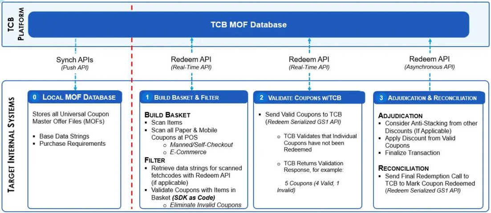
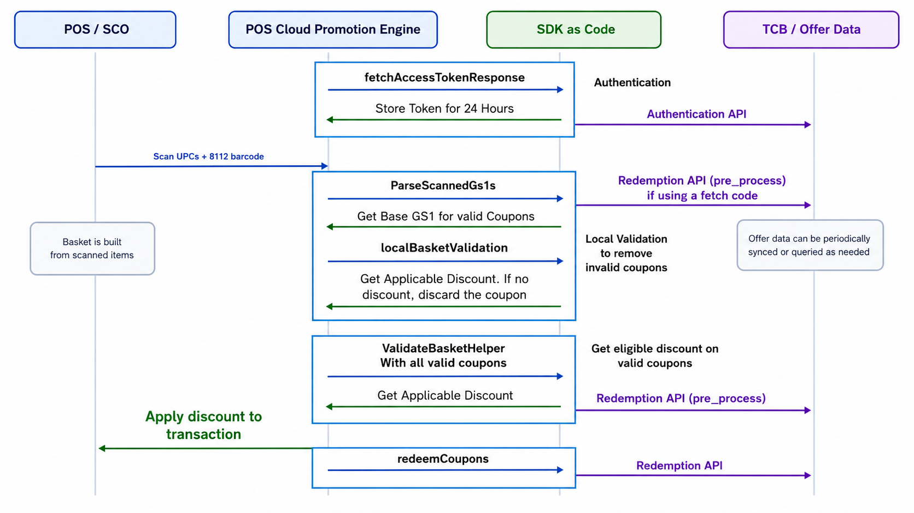

# Kotlin integration flow





## 1. Build the JAR

From the `java/` folder:

```bash
./build-jar.sh
```

Use the fat JAR for integration:

```bash
target/basket-validator-1.0-SNAPSHOT-all.jar
```

## 2. Add the JAR to your project

Copy the fat JAR into your application, for example:

```bash
your-kotlin-project/lib/basket-validator-1.0-SNAPSHOT-all.jar
```

After that, add the JAR from your `lib/` folder to your Kotlin project classpath using your normal build setup.

## 3. Step-by-step integration

This walkthrough uses real serialized coupon examples and `base_gs1` values from `java/POS_Basket_Validation_UseCases.xlsx`.

The `16`-digit fetch code below is illustrative. The workbook contains serialized coupon examples and offer data, but not the fetch-code-to-coupon mapping returned by TCB.

#### Step 1. Customer scans four serialized coupons and one fetch code

| Scan order | Type | Scanned value |
| --- | --- | --- |
| 1 | Serialized coupon | `8112009988459000019133924009755364` |
| 2 | Serialized coupon | `8112009988459000039133772240739897` |
| 3 | Serialized coupon | `8112009988459000049133939957096441` |
| 4 | Serialized coupon | `8112009988459000199133935966961409` |
| 5 | 16-digit fetch code | `8112209988459000` |

#### Step 2. Get the TCB token

Request:

```kotlin
val accessToken = org.thecouponbureau.validate.basket.Services.TcbTokenService.fetchAccessToken(
    "https://api.try.thecouponbureau.org",
    "YOUR_ACCESS_KEY",
    "YOUR_SECRET_KEY"
)
```

Response:

```json
{
  "status": "success",
  "x-access-token": "YOUR_ACCESS_TOKEN"
}
```

#### Step 3. Resolve scanned values into serialized coupons and `base_gs1`

Request:

```kotlin
import com.fasterxml.jackson.databind.ObjectMapper
import com.fasterxml.jackson.databind.PropertyNamingStrategies
import org.thecouponbureau.validate.basket.Services.TcbScannedGs1Service

val resolved = TcbScannedGs1Service.parseScannedGs1s(
    "https://api.try.thecouponbureau.org/",
    "YOUR_ACCESS_KEY",
    accessToken,
    listOf(
        "8112009988459000019133924009755364",
        "8112009988459000039133772240739897",
        "8112009988459000049133939957096441",
        "8112009988459000199133935966961409",
        "8112209988459000"
    )
)

val mapper = ObjectMapper().apply {
    propertyNamingStrategy = PropertyNamingStrategies.SNAKE_CASE
}

println("Resolved scanned GS1 response:")
println(mapper.writerWithDefaultPrettyPrinter().writeValueAsString(resolved))

resolved.forEach { item ->
    println(
        "serialized_gs1=${item.gs1}, base_gs1=${item.baseGs1}, validated=${item.validated}"
    )
}
```

- The first four scanned values already start with `8112`, so `parseScannedGs1s(...)` parses them locally.
- The `16`-digit fetch code is sent to TCB in its own redemption request.
- Assume TCB returns the following additional serialized coupons from that fetch code.

Response:

```json
[
  {
    "gs1": "8112009988459000019133924009755364",
    "base_gs1": "811200998845900001"
  },
  {
    "gs1": "8112009988459000039133772240739897",
    "base_gs1": "811200998845900003"
  },
  {
    "gs1": "8112009988459000049133939957096441",
    "base_gs1": "811200998845900004"
  },
  {
    "gs1": "8112009988459000199133935966961409",
    "base_gs1": "811200998845900019"
  },
  {
    "gs1": "8112009988459000019133520317194861",
    "base_gs1": "811200998845900001",
    "validated": true
  }
]
```

| Source | Serialized coupon | `base_gs1` |
| --- | --- | --- |
| Local parse | `8112009988459000019133924009755364` | `811200998845900001` |
| Local parse | `8112009988459000039133772240739897` | `811200998845900003` |
| Local parse | `8112009988459000049133939957096441` | `811200998845900004` |
| Local parse | `8112009988459000199133935966961409` | `811200998845900019` |
| TCB fetch-code response | `8112009988459000019133520317194861` | `811200998845900001` |
| TCB fetch-code response | `8112009988459000039133690612006084` | `811200998845900003` |
| TCB fetch-code response | `8112009988459000049133457646689353` | `811200998845900004` |
| TCB fetch-code response | `8112009988459000059133286213033835` | `811200998845900005` |
| TCB fetch-code response | `8112009988459000089133401940529627` | `811200998845900008` |
| TCB fetch-code response | `8112009988459000119133614973675487` | `811200998845900011` |
| TCB fetch-code response | `8112009988459000129133212234898075` | `811200998845900012` |
| TCB fetch-code response | `8112009988459000139133621151540206` | `811200998845900013` |
| TCB fetch-code response | `8112009988459000149133342361220548` | `811200998845900014` |
| TCB fetch-code response | `8112009988459000199133782272284945` | `811200998845900019` |

For TCB fetch-code results, `validated = true` means the coupon was already validated by TCB during fetch-code expansion.

#### Step 4. Load purchase requirements from the local `base_gs1` database

Use `base_gs1` as the key into your local offer / purchase-requirement database.

Response from local DB lookup:

| `base_gs1` | Workbook offer summary |
| --- | --- |
| `811200998845900001` | Buy 2 Products in Group A and Save $1.00 |
| `811200998845900003` | Buy any 2 products from A or B and save $1.00 |
| `811200998845900004` | Buy any 2 products from A or B or C and save $1.00 |
| `811200998845900005` | Buy 1 get 1 free up to $1.99 |
| `811200998845900008` | Buy 5 Products in Group A and get 2 Free from Group B |
| `811200998845900011` | Buy 1 item from Group A get 1 item from Group B free up to $1.99 |
| `811200998845900012` | Spend $5 on chips OR dip OR soda and get $2 off |
| `811200998845900013` | Spend $5 on chips AND dip AND soda and get $3 off |
| `811200998845900014` | Spend $5 on chips AND dip OR soda and get $2 off |
| `811200998845900019` | Buy 1A and 2B and 3C and get $3 off |

#### Step 5. Build coupon objects from resolved GS1 values and local purchase requirements

Request:

```kotlin
import org.thecouponbureau.validate.basket.model.basketValidationResults.InputCoupon
import org.thecouponbureau.validate.basket.model.basketValidationResults.PurchaseRequirement

val purchaseRequirementDb: Map<String, PurchaseRequirement> = loadPurchaseRequirementDb()

val coupons = mutableListOf<InputCoupon>()
for (item in resolved) {
    val purchaseRequirement = purchaseRequirementDb[item.baseGs1] ?: continue

    coupons.add(
        InputCoupon().apply {
            gs1 = item.gs1
            this.purchaseRequirement = purchaseRequirement
        }
    )
}
```

Response:

```json
{
  "coupons": [
    {
      "gs1": "8112009988459000019133924009755364",
      "purchase_requirement": { "...": "loaded from local DB using 811200998845900001" }
    },
    {
      "gs1": "8112009988459000039133772240739897",
      "purchase_requirement": { "...": "loaded from local DB using 811200998845900003" }
    },
    {
      "gs1": "8112009988459000049133939957096441",
      "purchase_requirement": { "...": "loaded from local DB using 811200998845900004" }
    },
    {
      "gs1": "8112009988459000199133935966961409",
      "purchase_requirement": { "...": "loaded from local DB using 811200998845900019" }
    },
    {
      "gs1": "8112009988459000139133621151540206",
      "purchase_requirement": { "...": "loaded from local DB using 811200998845900013" }
    },
    {
      "gs1": "8112009988459000089133401940529627",
      "purchase_requirement": { "...": "loaded from local DB using 811200998845900008" }
    }
  ]
}
```

#### Step 6. Build the basket and perform local rejection first

Request basket:

Basket example:

| Product code | Qty | Price |
| --- | --- | --- |
| `037000930396` | 1 | `1.29` |
| `037000934677` | 1 | `1.34` |
| `030772076835` | 2 | `3.07` |
| `037000534358` | 1 | `6.62` |
| `037000808893` | 1 | `5.64` |
| `7106919588011` | 1 | `1.81` |
| `8952803493171` | 1 | `4.67` |

Call `localBasketValidation(...)` one coupon at a time in this step.

Important:

This method does not take TCB credentials. It only uses the basket and the locally loaded `purchase_requirement`.

Request:

```kotlin
import org.thecouponbureau.validate.basket.core.BasketValidator
import org.thecouponbureau.validate.basket.model.basketValidationResults.InputCoupon
import org.thecouponbureau.validate.basket.model.basketValidationResults.LocalBasketValidationInput

val locallyEligibleCoupons = mutableListOf<InputCoupon>()

for (coupon in coupons) {
    val localInput = LocalBasketValidationInput().apply {
        this.basket = basket
        this.coupons = mutableListOf(coupon)
    }

    val localResult = BasketValidator.localBasketValidation(localInput)

    if (localResult.error != null) {
        continue
    }

    if (localResult.basketValidationOutput != null
        && localResult.basketValidationOutput.discountInCents > 0
    ) {
        locallyEligibleCoupons.add(coupon)
    }
}
```

Response:

```json
{
  "eligible_coupon_gs1s": [
    "8112009988459000019133924009755364",
    "8112009988459000039133772240739897",
    "8112009988459000049133939957096441"
  ],
  "rejected_coupon_gs1s": [
    "8112009988459000199133935966961409",
    "8112009988459000139133621151540206",
    "8112009988459000089133401940529627"
  ]
}
```

Coupons kept after local filtering for the second pass:

- `8112009988459000019133924009755364`
- `8112009988459000039133772240739897`
- `8112009988459000049133939957096441`

#### Step 7. Build the validation input

In this second pass, send coupon objects in `coupons` with:

- `gs1`
- `purchase_requirement`
- optional `validated = true`

Optimization:

- if `validated = true`, `validateBasketHelper(...)` skips the TCB validation call for that coupon
- if `validated` is not `true`, `validateBasketHelper(...)` calls TCB `retailer/redeem` with:
  - `pre_process = "yes"`
  - `no_purchase_requirement = "yes"`
- coupons not returned in `newly_redeemed` are removed
- the remaining coupons already have local `purchase_requirement` objects, so the final discount is calculated locally

Request:

```kotlin
import org.thecouponbureau.validate.basket.model.basketValidationResults.BasketItem
import org.thecouponbureau.validate.basket.model.basketValidationResults.BasketValidationInput

val basket = mutableListOf(
    BasketItem().apply {
        productCode = "037000930396"
        price = 1.29
        quantity = 1
        unit = "item"
    },
    BasketItem().apply {
        productCode = "037000934677"
        price = 1.34
        quantity = 1
        unit = "item"
    },
    BasketItem().apply {
        productCode = "030772076835"
        price = 3.07
        quantity = 2
        unit = "item"
    },
    BasketItem().apply {
        productCode = "037000534358"
        price = 6.62
        quantity = 1
        unit = "item"
    },
    BasketItem().apply {
        productCode = "037000808893"
        price = 5.64
        quantity = 1
        unit = "item"
    }
)

val coupons = locallyEligibleCoupons.map { localCoupon ->
    InputCoupon().apply {
        gs1 = localCoupon.gs1
        purchaseRequirement = localCoupon.purchaseRequirement
        validated = localCoupon.validated
    }
}.toMutableList()

val input = BasketValidationInput().apply {
    this.basket = basket
    this.coupons = coupons
}
```

Resulting input payload shape:

```json
{
  "basket": [
    { "product_code": "037000930396", "price": 1.29, "quantity": 1, "unit": "item" },
    { "product_code": "037000934677", "price": 1.34, "quantity": 1, "unit": "item" },
    { "product_code": "030772076835", "price": 3.07, "quantity": 2, "unit": "item" },
    { "product_code": "037000534358", "price": 6.62, "quantity": 1, "unit": "item" },
    { "product_code": "037000808893", "price": 5.64, "quantity": 1, "unit": "item" }
  ],
  "coupons": [
    {
      "gs1": "8112009988459000019133924009755364",
      "purchase_requirement": { "...": "loaded from local DB using 811200998845900001" },
      "validated": true
    },
    {
      "gs1": "8112009988459000039133772240739897",
      "purchase_requirement": { "...": "loaded from local DB using 811200998845900003" }
    },
    {
      "gs1": "8112009988459000049133939957096441",
      "purchase_requirement": { "...": "loaded from local DB using 811200998845900004" }
    }
  ]
}
```

#### Step 8. Call `validateBasketHelper(...)`

Request:

```kotlin
input.tcbBaseUrl = "https://api.try.thecouponbureau.org"
input.tcbAccessKey = "YOUR_ACCESS_KEY"
input.tcbAccessToken = accessToken

val result = BasketValidator.validateBasketHelper(input)
```

What happens inside this second validation pass:

1. Coupons with `validated = true` are kept as already validated.
2. Coupons without `validated = true` are sent to TCB `retailer/redeem`.
3. That TCB request uses `pre_process = "yes"` and `no_purchase_requirement = "yes"`.
4. Coupons not returned in `newly_redeemed` are removed.
5. Final basket validation runs locally using the surviving coupons and their local `purchase_requirement` objects.

Response:

```json
{
  "discount_in_cents": 300,
  "applied_coupons": [
    {
      "coupon_code": "8112009988459000019133924009755364",
      "face_value_in_cents": 100,
      "product_codes": {
        "gtins": [
          "037000930396",
          "037000934677"
        ]
      }
    },
    {
      "coupon_code": "8112009988459000039133772240739897",
      "face_value_in_cents": 100,
      "product_codes": {
        "gtins": [
          "030772076835"
        ]
      }
    },
    {
      "coupon_code": "8112009988459000049133939957096441",
      "face_value_in_cents": 100,
      "product_codes": {
        "gtins": [
          "037000534358",
          "037000808893"
        ]
      }
    }
  ]
}
```

#### Step 8. Apply the discount

Use `result.basketValidationOutput.discountInCents` as the transaction discount.

Response used by POS:

```json
{
  "discount_in_cents": 300
}
```

#### Step 9. Redeem coupons in TCB after discount application

Request:

```kotlin
val redeemResponseJson =
    org.thecouponbureau.validate.basket.Services.TcbCouponRedeemService.redeemCoupons(
        "https://api.try.thecouponbureau.org",
        "YOUR_ACCESS_KEY",
        accessToken,
        listOf(
            "8112009988459000019133924009755364",
            "8112009988459000039133772240739897",
            "8112009988459000049133939957096441"
        )
    )
```

Response:

```json
{
  "status": "success",
  "status_code": "FULL_REDEMPTION",
  "newly_redeemed": [
    {
      "gs1": "8112009988459000019133924009755364",
      "master_offer_file": "811200998845900001"
    },
    {
      "gs1": "8112009988459000039133772240739897",
      "master_offer_file": "811200998845900003"
    },
    {
      "gs1": "8112009988459000049133939957096441",
      "master_offer_file": "811200998845900004"
    }
  ],
  "total_gs1s_processed": 3,
  "message": "Redeemed 3 gs1(s)"
}
```

#### Step 10. Roll back redeemed coupons if the transaction is voided

Request:

```kotlin
val rollbackResponses =
    org.thecouponbureau.validate.basket.Services.TcbCouponRollbackService.rollbackCoupons(
        "https://api.try.thecouponbureau.org",
        "YOUR_ACCESS_KEY",
        accessToken,
        listOf(
            "8112009988459000019133924009755364",
            "8112009988459000039133772240739897",
            "8112009988459000049133939957096441"
        )
    )
```

Response:

```json
{
  "8112009988459000019133924009755364": "{\"status\":\"success\",\"message\":\"Coupon rollback successful\"}",
  "8112009988459000039133772240739897": "{\"status\":\"success\",\"message\":\"Coupon rollback successful\"}",
  "8112009988459000049133939957096441": "{\"status\":\"success\",\"message\":\"Coupon rollback successful\"}"
}
```

## End-to-End Flow Diagram

```text
1. POS scans coupons and builds basket
   |
   v
2. Parse scanned GS1 values
   - serialized GS1s parsed locally
   - fetch codes expanded through TCB if needed
   |
   v
3. Use base_gs1 to load purchase requirements from local DB
   |
   v
4. Call localBasketValidation(...) one coupon at a time
   - drop coupons that are not basket-eligible locally
   |
   v
5. Build final validateBasketHelper(...) input
   - gs1
   - purchase_requirement
   - validated=true only for coupons already validated earlier
   |
   v
6. Call validateBasketHelper(...)
   - skips TCB for validated=true coupons
   - calls TCB retailer/redeem for remaining coupons
     with pre_process=yes and no_purchase_requirement=yes
   - removes coupons not returned in newly_redeemed
   - calculates final discount locally
   |
   v
7. POS applies discount to transaction
   |
   v
8. After transaction success, call redeemCoupons(...)
   |
   v
9. If transaction is voided later, call rollbackCoupons(...)
```

## Complete Kotlin Example

The following example hardcodes basket data and coupon purchase requirements directly in code and shows the full SDK flow without using any fetch code.

```kotlin
01 package demo
02 
03 import org.thecouponbureau.validate.basket.Services.TcbCouponRedeemService
04 import org.thecouponbureau.validate.basket.Services.TcbCouponRollbackService
05 import org.thecouponbureau.validate.basket.Services.TcbTokenService
06 import org.thecouponbureau.validate.basket.core.BasketValidator
07 import org.thecouponbureau.validate.basket.model.basketValidationResults.AppliedCoupon
08 import org.thecouponbureau.validate.basket.model.basketValidationResults.BasketItem
09 import org.thecouponbureau.validate.basket.model.basketValidationResults.BasketValidationInput
10 import org.thecouponbureau.validate.basket.model.basketValidationResults.InputCoupon
11 import org.thecouponbureau.validate.basket.model.basketValidationResults.LocalBasketValidationInput
12 import org.thecouponbureau.validate.basket.model.basketValidationResults.PurchaseRequirement
13 import org.thecouponbureau.validate.basket.model.basketValidationResults.ValidationResult
14 
15 object EndToEndBasketValidationExample {
16 
17     @JvmStatic
18     fun main(args: Array<String>) {
19         val tcbBaseUrl = "https://api.try.thecouponbureau.org"
20         val tcbAccessKey = "YOUR_ACCESS_KEY"
21         val tcbSecretKey = "YOUR_SECRET_KEY"
22 
23         val accessToken = TcbTokenService.fetchAccessToken(
24             tcbBaseUrl,
25             tcbAccessKey,
26             tcbSecretKey
27         )
28 
29         val basket = buildBasket()
30         val couponsFromLocalDb = buildCouponsFromLocalDb()
31 
32         val locallyEligibleCoupons = mutableListOf<InputCoupon>()
33 
34         for (coupon in couponsFromLocalDb) {
35             val localInput = LocalBasketValidationInput().apply {
36                 this.basket = basket
37                 this.coupons = mutableListOf(coupon)
38             }
39 
40             val localResult = BasketValidator.localBasketValidation(localInput)
41 
42             if (localResult.error != null) {
43                 continue
44             }
45 
46             if (localResult.basketValidationOutput != null
47                 && localResult.basketValidationOutput.discountInCents > 0
48             ) {
49                 locallyEligibleCoupons.add(coupon)
50             }
51         }
52 
53         val validateInput = BasketValidationInput().apply {
54             this.basket = basket
55             this.coupons = locallyEligibleCoupons
56             this.tcbBaseUrl = tcbBaseUrl
57             this.tcbAccessKey = tcbAccessKey
58             this.tcbAccessToken = accessToken
59             this.enableLogging = true
60         }
61 
62         val finalResult = BasketValidator.validateBasketHelper(validateInput)
63 
64         println("discount_in_cents = ${finalResult.basketValidationOutput.discountInCents}")
65 
66         for (appliedCoupon: AppliedCoupon in finalResult.basketValidationOutput.appliedCoupons) {
67             println("coupon_code = ${appliedCoupon.couponCode}")
68             println("face_value_in_cents = ${appliedCoupon.faceValueInCents}")
69             println("gtins = ${appliedCoupon.productCodes["gtins"]}")
70         }
71 
72         val appliedCouponGs1s = finalResult.basketValidationOutput.appliedCoupons
73             .map { appliedCoupon -> appliedCoupon.couponCode }
74 
75         // Transaction done in POS using finalResult.basketValidationOutput.discountInCents
76         // Only after transaction success should retailer redeem the applied coupons in TCB.
77 
78         val redeemResponse = TcbCouponRedeemService.redeemCoupons(
79             tcbBaseUrl,
80             tcbAccessKey,
81             accessToken,
82             appliedCouponGs1s
83         )
84 
85         println("redeemResponse = $redeemResponse")
86 
87         // If transaction is voided later, roll back those redeemed coupons.
88         val rollbackResponses = TcbCouponRollbackService.rollbackCoupons(
89             tcbBaseUrl,
90             tcbAccessKey,
91             accessToken,
92             appliedCouponGs1s
93         )
94 
95         println("rollbackResponses = $rollbackResponses")
96     }
97 
98     private fun buildBasket(): MutableList<BasketItem> {
99         return mutableListOf(
100             basketItem("037000930396", 1.29, 1),
101             basketItem("037000934677", 1.34, 1),
102             basketItem("030772076835", 3.07, 2),
103             basketItem("037000534358", 6.62, 1),
104             basketItem("037000808893", 5.64, 1)
105         )
106     }
107 
108     private fun buildCouponsFromLocalDb(): MutableList<InputCoupon> {
109         val couponOne = InputCoupon().apply {
110             gs1 = "8112009988459000019133924009755364"
111             purchaseRequirement = purchaseRequirement(
112                 primaryPurchaseGtins = listOf("037000930396", "037000934677", "012345678912"),
113                 primaryPurchaseEans = listOf("7106919588011", "8952803493171", "5012345678900"),
114                 primaryPurchaseSaveValue = 100L,
115                 primaryPurchaseRequirements = 2L,
116                 primaryPurchaseReqCode = 0,
117                 saveValueCode = 0
118             )
119         }
120 
121         val couponTwo = InputCoupon().apply {
122             gs1 = "8112009988459000039133772240739897"
123             purchaseRequirement = purchaseRequirement(
124                 primaryPurchaseGtins = listOf("037000761648", "037000925323"),
125                 primaryPurchaseEans = listOf("030772076835", "030772076880"),
126                 primaryPurchaseSaveValue = 100L,
127                 primaryPurchaseRequirements = 2L,
128                 primaryPurchaseReqCode = 0,
129                 saveValueCode = 0
130             )
131         }
132 
133         val couponThree = InputCoupon().apply {
134             gs1 = "8112009988459000049133939957096441"
135             purchaseRequirement = purchaseRequirement(
136                 primaryPurchaseGtins = listOf("037000523550", "037000758365"),
137                 primaryPurchaseEans = listOf("030772118054", "030772118092"),
138                 primaryPurchaseSaveValue = 100L,
139                 primaryPurchaseRequirements = 2L,
140                 primaryPurchaseReqCode = 0,
141                 saveValueCode = 0
142             )
143         }
144 
145         return mutableListOf(couponOne, couponTwo, couponThree)
146     }
147 
148     private fun purchaseRequirement(
149         primaryPurchaseGtins: List<String>,
150         primaryPurchaseEans: List<String>,
151         primaryPurchaseSaveValue: Long,
152         primaryPurchaseRequirements: Long,
153         primaryPurchaseReqCode: Int,
154         saveValueCode: Int
155     ): PurchaseRequirement {
156         return PurchaseRequirement().apply {
157             this.primaryPurchaseGtins = primaryPurchaseGtins
158             this.primaryPurchaseEans = primaryPurchaseEans
159             this.primaryPurchaseSaveValue = primaryPurchaseSaveValue
160             this.primaryPurchaseRequirements = primaryPurchaseRequirements
161             this.primaryPurchaseReqCode = primaryPurchaseReqCode
162             this.saveValueCode = saveValueCode
163         }
164     }
165 
166     private fun basketItem(productCode: String, price: Double, quantity: Int): BasketItem {
167         return BasketItem().apply {
168             this.productCode = productCode
169             this.price = price
170             this.quantity = quantity
171             this.unit = "item"
172         }
173     }
174 }
```
