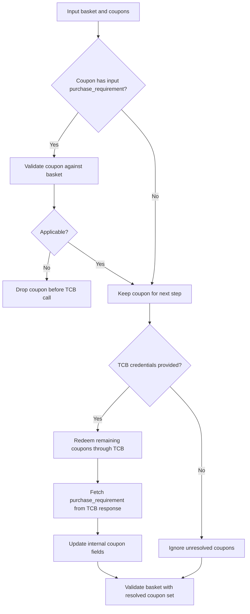

# Kotlin integration flow

## 1. Build the JAR

From the `java/` folder:

```bash
./build-jar.sh
```

Use the fat JAR for integration:

```bash
target/basket-validator-1.0-SNAPSHOT-all.jar
```

## 2. Add the JAR to your project

Copy the fat JAR into your application, for example:

```bash
your-kotlin-project/lib/basket-validator-1.0-SNAPSHOT-all.jar
```

After that, add the JAR from your `lib/` folder to your Kotlin project classpath using your normal build setup.

## 3. Step-by-step integration

This walkthrough uses real serialized coupon examples and `base_gs1` values from `java/POS_Basket_Validation_UseCases.xlsx`.

The `16`-digit fetch code below is illustrative. The workbook contains serialized coupon examples and offer data, but not the fetch-code-to-coupon mapping returned by TCB.

#### Step 1. Customer scans four serialized coupons and one fetch code

| Scan order | Type | Scanned value |
| --- | --- | --- |
| 1 | Serialized coupon | `8112009988459000019133924009755364` |
| 2 | Serialized coupon | `8112009988459000039133772240739897` |
| 3 | Serialized coupon | `8112009988459000049133939957096441` |
| 4 | Serialized coupon | `8112009988459000199133935966961409` |
| 5 | 16-digit fetch code | `8112209988459000` |

#### Step 2. Resolve scanned values into serialized coupons and `base_gs1`

Request:

```kotlin
val resolved = TcbScannedGs1Service.parseScannedGs1s(
    "https://api.try.thecouponbureau.org/",
    "YOUR_ACCESS_KEY",
    accessToken,
    listOf(
        "8112009988459000019133924009755364",
        "8112009988459000039133772240739897",
        "8112009988459000049133939957096441",
        "8112009988459000199133935966961409",
        "8112209988459000"
    )
)
```

- The first four scanned values already start with `8112`, so `parseScannedGs1s(...)` parses them locally.
- The `16`-digit fetch code is sent to TCB in its own redemption request.
- Assume TCB returns the following additional serialized coupons from that fetch code.

Response:

| Source | Serialized coupon | `base_gs1` |
| --- | --- | --- |
| Local parse | `8112009988459000019133924009755364` | `811200998845900001` |
| Local parse | `8112009988459000039133772240739897` | `811200998845900003` |
| Local parse | `8112009988459000049133939957096441` | `811200998845900004` |
| Local parse | `8112009988459000199133935966961409` | `811200998845900019` |
| TCB fetch-code response | `8112009988459000019133520317194861` | `811200998845900001` |
| TCB fetch-code response | `8112009988459000039133690612006084` | `811200998845900003` |
| TCB fetch-code response | `8112009988459000049133457646689353` | `811200998845900004` |
| TCB fetch-code response | `8112009988459000059133286213033835` | `811200998845900005` |
| TCB fetch-code response | `8112009988459000089133401940529627` | `811200998845900008` |
| TCB fetch-code response | `8112009988459000119133614973675487` | `811200998845900011` |
| TCB fetch-code response | `8112009988459000129133212234898075` | `811200998845900012` |
| TCB fetch-code response | `8112009988459000139133621151540206` | `811200998845900013` |
| TCB fetch-code response | `8112009988459000149133342361220548` | `811200998845900014` |
| TCB fetch-code response | `8112009988459000199133782272284945` | `811200998845900019` |

#### Step 3. Load purchase requirements from the local `base_gs1` database

Use `base_gs1` as the key into your local offer / purchase-requirement database.

Response from local DB lookup:

| `base_gs1` | Workbook offer summary |
| --- | --- |
| `811200998845900001` | Buy 2 Products in Group A and Save $1.00 |
| `811200998845900003` | Buy any 2 products from A or B and save $1.00 |
| `811200998845900004` | Buy any 2 products from A or B or C and save $1.00 |
| `811200998845900005` | Buy 1 get 1 free up to $1.99 |
| `811200998845900008` | Buy 5 Products in Group A and get 2 Free from Group B |
| `811200998845900011` | Buy 1 item from Group A get 1 item from Group B free up to $1.99 |
| `811200998845900012` | Spend $5 on chips OR dip OR soda and get $2 off |
| `811200998845900013` | Spend $5 on chips AND dip AND soda and get $3 off |
| `811200998845900014` | Spend $5 on chips AND dip OR soda and get $2 off |
| `811200998845900019` | Buy 1A and 2B and 3C and get $3 off |

#### Step 4. Build the basket and perform local rejection first

Request basket:

Basket example:

| Product code | Qty | Price |
| --- | --- | --- |
| `037000930396` | 1 | `1.29` |
| `037000934677` | 1 | `1.34` |
| `030772076835` | 2 | `3.07` |
| `037000534358` | 1 | `6.62` |
| `037000808893` | 1 | `5.64` |
| `7106919588011` | 1 | `1.81` |
| `8952803493171` | 1 | `4.67` |

Local rejection examples before token fetch:

| Coupon | Why rejected locally |
| --- | --- |
| `8112009988459000199133935966961409` | `base_gs1 = 811200998845900019` needs `1A + 2B + 3C`; this basket has no third-group triplet |
| `8112009988459000139133621151540206` | `base_gs1 = 811200998845900013` needs spend across chips and dip and soda; this basket does not satisfy all groups |
| `8112009988459000089133401940529627` | `base_gs1 = 811200998845900008` needs 5 items from A and 2 free from B; this basket does not satisfy the quantity rule |

Call `validateBasketHelper(...)` one coupon at a time in this step.

Important:

- Do **not** set `tcbBaseUrl`
- Do **not** set `tcbAccessKey`
- Do **not** set `tcbAccessToken`

That makes `validateBasketHelper(...)` run as a local-only validation pass using only the basket and the locally loaded `purchase_requirement`.

Request:

```kotlin
import org.thecouponbureau.validate.basket.core.BasketValidator
import org.thecouponbureau.validate.basket.model.basketValidationResults.BasketValidationInput
import org.thecouponbureau.validate.basket.model.basketValidationResults.InputCoupon

val locallyEligibleCoupons = mutableListOf<InputCoupon>()

for (coupon in coupons) {
    val localInput = BasketValidationInput().apply {
        this.basket = basket
        this.coupons = mutableListOf(coupon)
    }

    val localResult = BasketValidator.validateBasketHelper(localInput)

    if (localResult.error != null) {
        continue
    }

    if (localResult.basketValidationOutput != null
        && localResult.basketValidationOutput.discountInCents > 0
    ) {
        locallyEligibleCoupons.add(coupon)
    }
}
```

Response:

```json
{
  "eligible_coupon_gs1s": [
    "8112009988459000019133924009755364",
    "8112009988459000039133772240739897",
    "8112009988459000049133939957096441"
  ],
  "rejected_coupon_gs1s": [
    "8112009988459000199133935966961409",
    "8112009988459000139133621151540206",
    "8112009988459000089133401940529627"
  ]
}
```

Coupons kept after local filtering for the second pass:

- `8112009988459000019133924009755364`
- `8112009988459000039133772240739897`
- `8112009988459000049133939957096441`

#### Step 5. Build the validation input

Request:

```kotlin
import org.thecouponbureau.validate.basket.model.basketValidationResults.BasketItem
import org.thecouponbureau.validate.basket.model.basketValidationResults.BasketValidationInput
import org.thecouponbureau.validate.basket.model.basketValidationResults.InputCoupon
import org.thecouponbureau.validate.basket.model.basketValidationResults.PurchaseRequirement

val basket = mutableListOf(
    BasketItem().apply {
        productCode = "037000930396"
        price = 1.29
        quantity = 1
        unit = "item"
    },
    BasketItem().apply {
        productCode = "037000934677"
        price = 1.34
        quantity = 1
        unit = "item"
    },
    BasketItem().apply {
        productCode = "030772076835"
        price = 3.07
        quantity = 2
        unit = "item"
    },
    BasketItem().apply {
        productCode = "037000534358"
        price = 6.62
        quantity = 1
        unit = "item"
    },
    BasketItem().apply {
        productCode = "037000808893"
        price = 5.64
        quantity = 1
        unit = "item"
    }
)

val resolvedBaseGs1ByCoupon = mapOf(
    "8112009988459000019133924009755364" to "811200998845900001",
    "8112009988459000039133772240739897" to "811200998845900003",
    "8112009988459000049133939957096441" to "811200998845900004"
)

val purchaseRequirementDb: Map<String, PurchaseRequirement> = loadPurchaseRequirementDb()

val coupons = locallyEligibleCoupons.map { localCoupon ->
    val gs1 = localCoupon.gs1
    InputCoupon().apply {
        this.gs1 = gs1
        purchaseRequirement = purchaseRequirementDb[resolvedBaseGs1ByCoupon[gs1]]
    }
}.toMutableList()

val input = BasketValidationInput().apply {
    this.basket = basket
    this.coupons = coupons
}
```

Resulting input payload shape:

```json
{
  "basket": [
    { "product_code": "037000930396", "price": 1.29, "quantity": 1, "unit": "item" },
    { "product_code": "037000934677", "price": 1.34, "quantity": 1, "unit": "item" },
    { "product_code": "030772076835", "price": 3.07, "quantity": 2, "unit": "item" },
    { "product_code": "037000534358", "price": 6.62, "quantity": 1, "unit": "item" },
    { "product_code": "037000808893", "price": 5.64, "quantity": 1, "unit": "item" }
  ],
  "coupons": [
    { "gs1": "8112009988459000019133924009755364", "purchase_requirement": { } },
    { "gs1": "8112009988459000039133772240739897", "purchase_requirement": { } },
    { "gs1": "8112009988459000049133939957096441", "purchase_requirement": { } }
  ]
}
```

#### Step 6. Get the TCB token

Request:

```kotlin
val accessToken = org.thecouponbureau.validate.basket.Services.TcbTokenService.fetchAccessToken(
    "https://api.try.thecouponbureau.org",
    "YOUR_ACCESS_KEY",
    "YOUR_SECRET_KEY"
)
```

Response:

```json
{
  "status": "success",
  "x-access-token": "YOUR_ACCESS_TOKEN"
}
```

#### Step 7. Call `validateBasketHelper(...)`

Request:

```kotlin
input.tcbBaseUrl = "https://api.try.thecouponbureau.org"
input.tcbAccessKey = "YOUR_ACCESS_KEY"
input.tcbAccessToken = accessToken

val result = BasketValidator.validateBasketHelper(input)
```

What happens inside this second validation pass:

1. Locally supplied `purchase_requirement` objects are checked first.
2. TCB `retailer/redeem` is called with `pre_process = "yes"` for the remaining coupons.
3. Coupons not returned in `newly_redeemed` are removed.
4. Final basket validation runs on the TCB-confirmed coupon set.

Response:

```json
{
  "basket_validation_output": {
    "discount_in_cents": 300,
    "applied_coupons": [
      {
        "coupon_code": "8112009988459000019133924009755364",
        "face_value_in_cents": 100,
        "product_codes": {
          "primary": [
            "037000930396",
            "037000934677"
          ]
        }
      },
      {
        "coupon_code": "8112009988459000039133772240739897",
        "face_value_in_cents": 100,
        "product_codes": {
          "secondary": [
            "030772076835"
          ]
        }
      },
      {
        "coupon_code": "8112009988459000049133939957096441",
        "face_value_in_cents": 100,
        "product_codes": {
          "third": [
            "037000534358",
            "037000808893"
          ]
        }
      }
    ]
  },
  "error": null
}
```

#### Step 8. Apply the discount

Use `result.basketValidationOutput.discountInCents` as the transaction discount.

Response used by POS:

```json
{
  "discount_in_cents": 300
}
```

#### Step 9. Redeem coupons in TCB after discount application

Request:

```kotlin
val redeemResponseJson =
    org.thecouponbureau.validate.basket.Services.TcbCouponRedeemService.redeemCoupons(
        "https://api.try.thecouponbureau.org",
        "YOUR_ACCESS_KEY",
        accessToken,
        listOf(
            "8112009988459000019133924009755364",
            "8112009988459000039133772240739897",
            "8112009988459000049133939957096441"
        )
    )
```

Response:

```json
{
  "status": "success",
  "status_code": "FULL_REDEMPTION",
  "newly_redeemed": [
    {
      "gs1": "8112009988459000019133924009755364",
      "master_offer_file": "811200998845900001"
    },
    {
      "gs1": "8112009988459000039133772240739897",
      "master_offer_file": "811200998845900003"
    },
    {
      "gs1": "8112009988459000049133939957096441",
      "master_offer_file": "811200998845900004"
    }
  ],
  "total_gs1s_processed": 3,
  "message": "Redeemed 3 gs1(s)"
}
```

#### Step 10. Roll back redeemed coupons if the transaction is voided

Request:

```kotlin
val rollbackResponses =
    org.thecouponbureau.validate.basket.Services.TcbCouponRollbackService.rollbackCoupons(
        "https://api.try.thecouponbureau.org",
        "YOUR_ACCESS_KEY",
        accessToken,
        listOf(
            "8112009988459000019133924009755364",
            "8112009988459000039133772240739897",
            "8112009988459000049133939957096441"
        )
    )
```

Response:

```json
{
  "8112009988459000019133924009755364": "{\"status\":\"success\",\"message\":\"Coupon rollback successful\"}",
  "8112009988459000039133772240739897": "{\"status\":\"success\",\"message\":\"Coupon rollback successful\"}",
  "8112009988459000049133939957096441": "{\"status\":\"success\",\"message\":\"Coupon rollback successful\"}"
}
```

## 6. Resolve scanned GS1s into serialized GS1 + base GS1

Use:

- `TcbScannedGs1Service.parseScannedGs1s(...)`

This method:

- accepts a list of scanned GS1 strings
- returns `gs1` and `base_gs1`
- if a scanned code is a valid serialized GS1, it is parsed locally with no TCB call
- if concatenated serialized GS1s are provided, each serialized GS1 is parsed locally with no TCB call
- only `16` digit scanned codes are sent to TCB `retailer/redeem`
- each `16` digit scanned code is sent in its own redemption request
- all redemption calls run in parallel
- TCB calls send `no_purchase_requirement = "yes"` to avoid returning purchase requirement data
- for TCB calls, only coupons present in `newly_redeemed` are returned
- does not return `purchase_requirement`

Kotlin example:

```kotlin
import org.thecouponbureau.validate.basket.Services.TcbScannedGs1Service
import org.thecouponbureau.validate.basket.Services.TcbTokenService

fun main() {
    val accessToken = TcbTokenService.fetchAccessToken(
        "https://api.try.thecouponbureau.org/",
        "YOUR_ACCESS_KEY",
        "YOUR_SECRET_KEY"
    )

    val resolved = TcbScannedGs1Service.parseScannedGs1s(
        "https://api.try.thecouponbureau.org/",
        "YOUR_ACCESS_KEY",
        accessToken,
        listOf(
            "8112209988459000329165266614604064",
            "8112209988459000340001"
        )
    )

    resolved.forEach { item ->
        println("${item.gs1} -> ${item.baseGs1}")
    }
}
```

Example resolve JSON response:

```json
[
  {
    "gs1": "8112209988459000329165266614604064",
    "base_gs1": "811220998845900032"
  },
  {
    "gs1": "8112109988459000269133321426026193",
    "base_gs1": "811210998845900026"
  },
  {
    "gs1": "8112109988459000269133587761214614",
    "base_gs1": "811210998845900026"
  }
]
```

## 7. Validate basket from Kotlin

The caller must send `gs1` for every coupon. The caller may also send optional `purchase_requirement` for some coupons. The validator uses this flow:

- first, coupons that already include `purchase_requirement` are checked against the basket
- coupons that are not applicable are removed before any TCB call
- then the remaining coupons are redeemed through TCB
- the SDK updates the internal coupon fields from the TCB response
- then final basket validation runs on the resolved coupon set
- if a coupon is not returned by TCB in `newly_redeemed`, it is removed before final validation



Then set these fields before calling:

```kotlin
input.tcbBaseUrl = "https://api.try.thecouponbureau.org"
input.tcbAccessKey = "YOUR_ACCESS_KEY"
input.tcbAccessToken = accessToken
```

If these are not set, unresolved coupons are ignored because the SDK cannot fetch `purchase_requirement`.

Example:

```kotlin
input.tcbBaseUrl = "https://api.try.thecouponbureau.org/"
input.tcbAccessKey = "8053fd0f80cf3778659def1359cac218"
input.tcbAccessToken = accessToken
```

Optional debug logging:

```kotlin
input.enableLogging = true
```

When `enableLogging` is `true`, the validator prints pretty JSON logs for:

- the input payload before validation starts
- each TCB resolution redeem request payload used to fetch missing `purchase_requirement`
- each TCB resolution redeem response body returned by the API
- the resolved coupon JSON after internal coupon fields are populated

The resolved output log also prints `coupon_gs1_order` so you can verify that coupon order is still maintained based on the input `gs1` values.

The input log redacts `tcbAccessKey` and `tcbAccessToken`.

Example validation JSON response:

```json
{
  "basket_validation_output": {
    "discount_in_cents": 100,
    "applied_coupons": [
      {
        "coupon_code": "8112109988459000269133321426026193",
        "face_value_in_cents": 100,
        "product_codes": {
          "primary": [
            "037000930396"
          ],
          "secondary": [
            "7106919588011"
          ],
          "third": [
            "037000925033"
          ]
        }
      }
    ]
  },
  "error": null
}
```

## 8. Redeem coupons in TCB after discount application

After your retailer system applies the discount, it should redeem the applied coupons in TCB.

Use:

- `TcbCouponRedeemService.redeemCoupons(...)`

This method:

- accepts a list of GS1 coupon codes
- uses the provided TCB access token
- calls the same `retailer/redeem` API
- if more than `15` GS1s are provided, splits them into chunks of `15`
- sends those redeem calls in parallel for faster network performance
- merges the chunk responses into one JSON response
- returns the raw JSON response body from TCB
- does not send the `pre_process` field
- generates one `client_txn_id` per chunked redemption request
- reuses that same `client_txn_id` across retries for idempotency

Kotlin example:

```kotlin
import org.thecouponbureau.validate.basket.Services.TcbCouponRedeemService
import org.thecouponbureau.validate.basket.Services.TcbTokenService

fun main() {
    val accessToken = TcbTokenService.fetchAccessToken(
        "https://api.try.thecouponbureau.org/",
        "8053fd0f80cf3778659def1359cac218",
        "eb42623aa2675e50f15da4f6d4aa0ad6"
    )

    val responseJson = TcbCouponRedeemService.redeemCoupons(
        "https://api.try.thecouponbureau.org/",
        "8053fd0f80cf3778659def1359cac218",
        accessToken,
        listOf(
            "8112109988459000269133321426026193",
            "8112109988459000269133587761214614"
        )
    )

    println(responseJson)
}
```

Note: `enableLogging` only affects validation-time GS1 resolution inside `BasketValidator.validateBasketHelper(...)`. It does not change the output of `TcbCouponRedeemService.redeemCoupons(...)`.

Example redeem JSON response:

```json
{
  "status": "success",
  "status_code": "FULL_REDEMPTION",
  "newly_redeemed": [
    {
      "gs1": "8112109988459000269133321426026193",
      "master_offer_file": "811210998845900026",
      "stakeholders_email_domain": []
    },
    {
      "gs1": "8112109988459000269133587761214614",
      "master_offer_file": "811210998845900026",
      "stakeholders_email_domain": []
    }
  ],
  "total_gs1s_processed": 2,
  "message": "Redeemed 2 gs1(s)",
  "execution_id": "44ac8356-9e97-46a7-afd2-5d826b0a872e"
}
```

## 9. Dependency note

For application integration, use:

```bash
target/basket-validator-1.0-SNAPSHOT-all.jar
```

That fat JAR already includes dependencies for embedding in your Kotlin project.

## 10. Rollback redeemed coupons in TCB

If your retailer needs to reverse previously redeemed coupons, use:

- `TcbCouponRollbackService.rollbackCoupons(...)`

This method:

- accepts a list of GS1 coupon codes
- uses the provided TCB access token
- calls `DELETE /retailer/rollback/{gs1}`
- calls each rollback in parallel, one API request per GS1
- returns a `Map<String, String>` where:
  - key = GS1
  - value = raw JSON response from TCB

Kotlin example:

```kotlin
import org.thecouponbureau.validate.basket.Services.TcbCouponRollbackService
import org.thecouponbureau.validate.basket.Services.TcbTokenService

fun main() {
    val accessToken = TcbTokenService.fetchAccessToken(
        "https://api.try.thecouponbureau.org/",
        "8053fd0f80cf3778659def1359cac218",
        "eb42623aa2675e50f15da4f6d4aa0ad6"
    )

    val rollbackResponses = TcbCouponRollbackService.rollbackCoupons(
        "https://api.try.thecouponbureau.org/",
        "8053fd0f80cf3778659def1359cac218",
        accessToken,
        listOf(
            "8112109988459000269133321426026193",
            "8112109988459000269133587761214614"
        )
    )

    rollbackResponses.forEach { (gs1, responseJson) ->
        println("$gs1 -> $responseJson")
    }
}
```

Example rollback JSON response map:

```json
{
  "8112109988459000269133321426026193": "{\"status\":\"success\",\"message\":\"Coupon rollback successful\"}",
  "8112109988459000269133587761214614": "{\"status\":\"success\",\"message\":\"Coupon rollback successful\"}"
}
```
