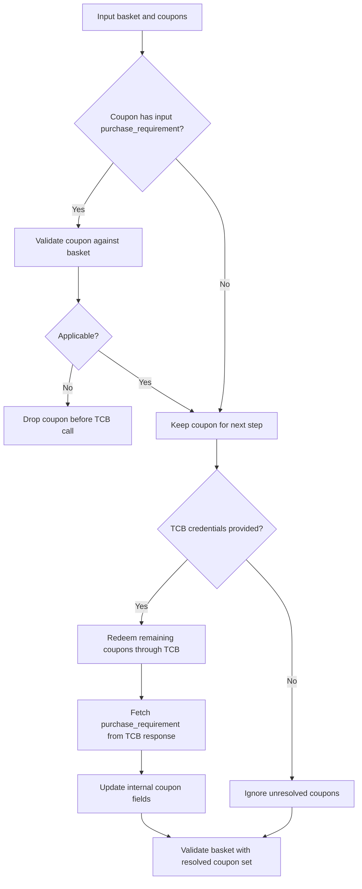

# Using `basket-validator-1.0-SNAPSHOT.jar` from Kotlin

Use this package as a library from your Kotlin code.

This project builds:

```bash
target/basket-validator-1.0-SNAPSHOT.jar
```

## 1. Build the JAR

From the `java/` folder:

```bash
./build-jar.sh
```

Output:

```bash
target/basket-validator-1.0-SNAPSHOT.jar
```

## 2. Add the JAR to your Kotlin project

If you are using a local/manual setup, copy the fat JAR into your Kotlin project:

```bash
your-kotlin-project/lib/basket-validator-1.0-SNAPSHOT-all.jar
```

## 3. Call the validator directly from Kotlin

Main classes:

- `org.thecouponbureau.validate.basket.Services.TcbTokenService`
- `org.thecouponbureau.validate.basket.Services.TcbScannedGs1Service`
- `org.thecouponbureau.validate.basket.core.BasketValidator`
- `org.thecouponbureau.validate.basket.model.basketValidationResults.BasketValidationInput`
- `org.thecouponbureau.validate.basket.model.basketValidationResults.BasketItem`
- `org.thecouponbureau.validate.basket.model.basketValidationResults.Coupon`
- `org.thecouponbureau.validate.basket.model.basketValidationResults.PurchaseRequirement`
- `org.thecouponbureau.validate.basket.Services.TcbCouponRedeemService`
- `org.thecouponbureau.validate.basket.Services.TcbCouponRollbackService`

Example:

```kotlin
import org.thecouponbureau.validate.basket.core.BasketValidator
import org.thecouponbureau.validate.basket.model.basketValidationResults.BasketItem
import org.thecouponbureau.validate.basket.model.basketValidationResults.BasketValidationInput
import org.thecouponbureau.validate.basket.model.basketValidationResults.InputCoupon
import org.thecouponbureau.validate.basket.model.basketValidationResults.PurchaseRequirement

fun main() {
    val item1 = BasketItem().apply {
        productCode = "037000930396"
        price = 1.29
        quantity = 1
        unit = "item"
    }

    val item2 = BasketItem().apply {
        productCode = "037000934677"
        price = 1.34
        quantity = 1
        unit = "item"
    }

    val coupon1 = InputCoupon().apply {
        gs1 = "8112009988459000019133924009755364"
        purchaseRequirement = PurchaseRequirement().apply {
            primaryPurchaseGtins = listOf("037000930396", "037000934677")
            primaryPurchaseSaveValue = 100L
            primaryPurchaseRequirements = 2L
            primaryPurchaseReqCode = 0
            saveValueCode = 0
        }
    }

    val coupon2 = InputCoupon().apply {
        gs1 = "8112009988459000019133222024880382"
    }

    val input = BasketValidationInput().apply {
        basket = mutableListOf(item1, item2)
        coupons = mutableListOf(coupon1, coupon2)
        tcbBaseUrl = "https://api.try.thecouponbureau.org/"
        tcbAccessKey = "YOUR_ACCESS_KEY"
        tcbAccessToken = org.thecouponbureau.validate.basket.Services.TcbTokenService.fetchAccessToken(
            tcbBaseUrl,
            tcbAccessKey,
            "YOUR_SECRET_KEY"
        )
    }

    val result = BasketValidator.validateBasketHelper(input)
    println(result.basketValidationOutput.discountInCents)
}
```

## 4. JSON-string driven usage from Kotlin

The Java models expect `snake_case` JSON when using Jackson.

This example shows the supported caller input shape:

- each coupon object must contain `gs1`
- each coupon object may also include optional `purchase_requirement`
- `base_gs1` is internal and should not be supplied by the caller

Example JSON:

```json
{
  "basket": [
    {
      "product_code": "037000758365",
      "price": 1.99,
      "quantity": 12,
      "unit": "item"
    },
    {
      "product_code": "7106919588011",
      "price": 1.81,
      "quantity": 2,
      "unit": "item"
    },
    {
      "product_code": "037000925033",
      "price": 1.59,
      "quantity": 3,
      "unit": "item"
    }
  ],
  "coupons": [
    {
      "gs1": "8112109988459000269133321426026193",
      "purchase_requirement": {
        "primary_purchase_gtins": [
          "037000930396",
          "037000934677"
        ],
        "primary_purchase_save_value": 100,
        "primary_purchase_requirements": 2,
        "primary_purchase_req_code": 0,
        "save_value_code": 0
      }
    },
    {
      "gs1": "8112109988459000269133587761214614"
    }
  ]
}
```

Kotlin example:

```kotlin
import com.fasterxml.jackson.databind.ObjectMapper
import com.fasterxml.jackson.databind.PropertyNamingStrategies
import org.thecouponbureau.validate.basket.core.BasketValidator
import org.thecouponbureau.validate.basket.model.basketValidationResults.BasketValidationInput

fun main() {
    val mapper = ObjectMapper().apply {
        propertyNamingStrategy = PropertyNamingStrategies.SNAKE_CASE
    }

    val jsonInput = """
        {
          "basket": [
            {
              "product_code": "037000758365",
              "price": 1.99,
              "quantity": 12,
              "unit": "item"
            },
            {
              "product_code": "7106919588011",
              "price": 1.81,
              "quantity": 2,
              "unit": "item"
            },
            {
              "product_code": "037000925033",
              "price": 1.59,
              "quantity": 3,
              "unit": "item"
            }
          ],
          "coupons": [
            {
              "gs1": "8112109988459000269133321426026193",
              "purchase_requirement": {
                "primary_purchase_gtins": [
                  "037000930396",
                  "037000934677"
                ],
                "primary_purchase_save_value": 100,
                "primary_purchase_requirements": 2,
                "primary_purchase_req_code": 0,
                "save_value_code": 0
              }
            },
            {
              "gs1": "8112109988459000269133587761214614"
            }
          ]
        }
    """.trimIndent()

    val input = mapper.readValue(
        jsonInput,
        BasketValidationInput::class.java
    )

    val result = BasketValidator.validateBasketHelper(input)
    println(mapper.writerWithDefaultPrettyPrinter().writeValueAsString(result))
}
```

## 5. Fetch TCB access token

Fetch the token first, then reuse that token for resolve, validate, redeem, and rollback.

Use:

- `TcbTokenService.fetchAccessToken(...)`

Example:

```kotlin
val accessToken = org.thecouponbureau.validate.basket.Services.TcbTokenService.fetchAccessToken(
    "https://api.try.thecouponbureau.org",
    "YOUR_ACCESS_KEY",
    "YOUR_SECRET_KEY"
)
```

## 6. Resolve scanned GS1s into serialized GS1 + base GS1

Use:

- `TcbScannedGs1Service.parseScannedGs1s(...)`

This method:

- accepts a list of scanned GS1 strings
- parses consumer serialized data strings locally when possible
- returns `gs1` and `base_gs1`
- if the scanned code is `16` digits, or not a consumer serialized data string, calls TCB `retailer/redeem`
- uses `newly_redeemed` from the TCB response
- returns only the serialized `gs1` and associated `base_gs1`
- does not return `purchase_requirement`

Kotlin example:

```kotlin
import org.thecouponbureau.validate.basket.Services.TcbScannedGs1Service
import org.thecouponbureau.validate.basket.Services.TcbTokenService

fun main() {
    val accessToken = TcbTokenService.fetchAccessToken(
        "https://api.try.thecouponbureau.org/",
        "YOUR_ACCESS_KEY",
        "YOUR_SECRET_KEY"
    )

    val resolved = TcbScannedGs1Service.parseScannedGs1s(
        "https://api.try.thecouponbureau.org/",
        "YOUR_ACCESS_KEY",
        accessToken,
        listOf(
            "8112209988459000329165266614604064",
            "8112209988459000340001"
        )
    )

    resolved.forEach { item ->
        println("${item.gs1} -> ${item.baseGs1}")
    }
}
```

## 7. Validate basket from Kotlin

The caller must send `gs1` for every coupon. The caller may also send optional `purchase_requirement` for some coupons. The validator uses this flow:

- first, coupons that already include `purchase_requirement` are checked against the basket
- coupons that are not applicable are removed before any TCB call
- then the remaining coupons are redeemed through TCB
- the SDK updates the internal coupon fields from the TCB response
- then final basket validation runs on the resolved coupon set



Then set these fields before calling:

```kotlin
input.tcbBaseUrl = "https://api.try.thecouponbureau.org"
input.tcbAccessKey = "YOUR_ACCESS_KEY"
input.tcbAccessToken = accessToken
```

If these are not set, unresolved coupons are ignored because the SDK cannot fetch `purchase_requirement`.

Example:

```kotlin
input.tcbBaseUrl = "https://api.try.thecouponbureau.org/"
input.tcbAccessKey = "8053fd0f80cf3778659def1359cac218"
input.tcbAccessToken = accessToken
```

Optional debug logging:

```kotlin
input.enableLogging = true
```

When `enableLogging` is `true`, the validator prints pretty JSON logs for:

- the input payload before validation starts
- each TCB resolution redeem request payload used to fetch missing `purchase_requirement`
- each TCB resolution redeem response body returned by the API
- the resolved coupon JSON after internal coupon fields are populated

The resolved output log also prints `coupon_gs1_order` so you can verify that coupon order is still maintained based on the input `gs1` values.

The input log redacts `tcbAccessKey` and `tcbAccessToken`.

## 8. Redeem coupons in TCB after discount application

After your retailer system applies the discount, it should redeem the applied coupons in TCB.

Use:

- `TcbCouponRedeemService.redeemCoupons(...)`

This method:

- accepts a list of GS1 coupon codes
- uses the provided TCB access token
- calls the same `retailer/redeem` API
- if more than `15` GS1s are provided, splits them into chunks of `15`
- sends those redeem calls in parallel for faster network performance
- merges the chunk responses into one JSON response
- returns the raw JSON response body from TCB
- does not send the `pre_process` field
- generates one `client_txn_id` per chunked redemption request
- reuses that same `client_txn_id` across retries for idempotency

Kotlin example:

```kotlin
import org.thecouponbureau.validate.basket.Services.TcbCouponRedeemService
import org.thecouponbureau.validate.basket.Services.TcbTokenService

fun main() {
    val accessToken = TcbTokenService.fetchAccessToken(
        "https://api.try.thecouponbureau.org/",
        "8053fd0f80cf3778659def1359cac218",
        "eb42623aa2675e50f15da4f6d4aa0ad6"
    )

    val responseJson = TcbCouponRedeemService.redeemCoupons(
        "https://api.try.thecouponbureau.org/",
        "8053fd0f80cf3778659def1359cac218",
        accessToken,
        listOf(
            "8112109988459000269133321426026193",
            "8112109988459000269133587761214614"
        )
    )

    println(responseJson)
}
```

Note: `enableLogging` only affects validation-time GS1 resolution inside `BasketValidator.validateBasketHelper(...)`. It does not change the output of `TcbCouponRedeemService.redeemCoupons(...)`.

## 9. Dependency note

For application integration, use:

```bash
target/basket-validator-1.0-SNAPSHOT-all.jar
```

That fat JAR already includes dependencies for embedding in your Kotlin project.

## 10. Rollback redeemed coupons in TCB

If your retailer needs to reverse previously redeemed coupons, use:

- `TcbCouponRollbackService.rollbackCoupons(...)`

This method:

- accepts a list of GS1 coupon codes
- uses the provided TCB access token
- calls `DELETE /retailer/rollback/{gs1}`
- calls each rollback in parallel, one API request per GS1
- returns a `Map<String, String>` where:
  - key = GS1
  - value = raw JSON response from TCB

Kotlin example:

```kotlin
import org.thecouponbureau.validate.basket.Services.TcbCouponRollbackService
import org.thecouponbureau.validate.basket.Services.TcbTokenService

fun main() {
    val accessToken = TcbTokenService.fetchAccessToken(
        "https://api.try.thecouponbureau.org/",
        "8053fd0f80cf3778659def1359cac218",
        "eb42623aa2675e50f15da4f6d4aa0ad6"
    )

    val rollbackResponses = TcbCouponRollbackService.rollbackCoupons(
        "https://api.try.thecouponbureau.org/",
        "8053fd0f80cf3778659def1359cac218",
        accessToken,
        listOf(
            "8112109988459000269133321426026193",
            "8112109988459000269133587761214614"
        )
    )

    rollbackResponses.forEach { (gs1, responseJson) ->
        println("$gs1 -> $responseJson")
    }
}
```
